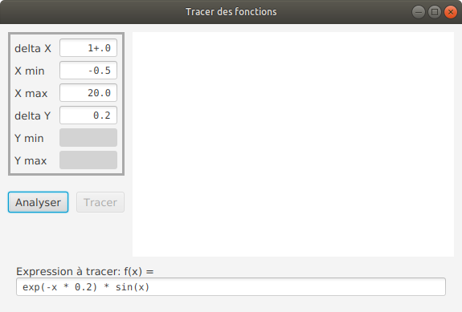
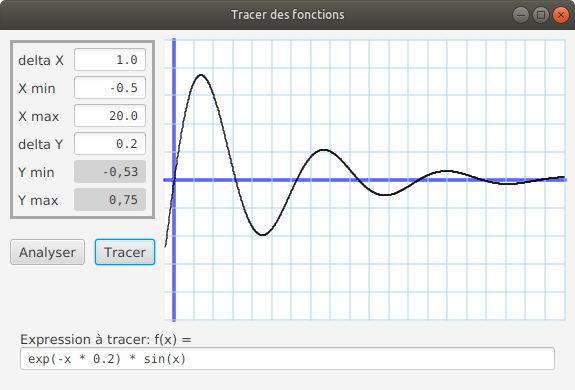
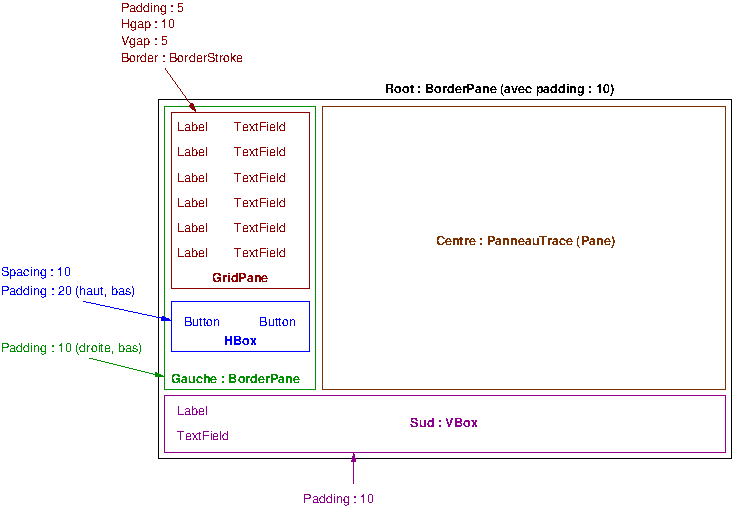

#  Introduction aux IHM en Java 

### IUT d’Aix-Marseille – Département Informatique Aix-en-Provence

* **Cours:** [M2105](http://cache.media.enseignementsup-recherche.gouv.fr/file/25/09/7/PPN_INFORMATIQUE_256097.pdf)
* **Responsable intérimaire:** [Cyril Pain-Barre](mailto:cyril.pain-barre@univ-amu.fr)
* **Responsable habituel:** [Sébastien NEDJAR](mailto:sebastien.nedjar@univ-amu.fr)
* **Enseignants actuels:** [Sophie Nabitz](mailto:sophie.nabitz@univ-avignon.fr), [Cyril Pain-Barre](mailto:cyril.pain-barre@univ-amu.fr)
* **Besoin d'aide ?**
    * La page [Piazza de ce cours](https://piazza.com/univ-amu.fr/spring2017/m2105/home).
    * Consulter et/ou créér des [issues](https://github.com/IUTInfoAix-M2105/soutien-rentree-2020/issues).
    * [Email](mailto:cyril.pain-barre@univ-amu.fr) pour une question d'ordre privée, ou pour convenir d'un rendez-vous physique.

## Soutien Post Covid : une dernière couche de Java / IHM pour préparer l'hiver

L'objectif de cette séance est de reprendre les notions clés de l'enseignement de Java / IHM et de la Programmation 
Orientée Objet du S2 de l'an dernier afin de consolider les connaissances acquises durant le confinement.

#### Création de votre fork du TP

Comme il a été d'usage en TP, commencez par créer un fork du dépôt de ce TP. Pour ce faire, rendez-vous sur le lien suivant (TODO): 

[https://classroom.github.com/a/1IYMeWTh](https://classroom.github.com/a/1IYMeWTh) 

Rappelons que GitHub va vous créer un dépôt contenant un fork du dépôt 'IUTInfoAix-m2105/soutien-rentree-2020' et s'appellant 'IUTInfoAix-m2105/soutien-rentree-2020-votreUsername'. 

#### Lancement et paramétrages de l'IDE

Puisque vous n'avez probablement jamais encore utilisé IntelliJ IDEA sur les postes de travail du département, il vous 
faut paramétrer cet IDE afin de réaliser ce TP.

Pour ce faire, reportez-vous à la [section du TP1 concernée par ce paramétrage](https://github.com/IUTInfoAix-M2105/tp1#parametrageIDEA) et suivre toutes les instructions qui 
vous étaient données.

#### Première application, en mode texte : Notation d'étudiants

On veut écrire une petite application qui permet de gérer des notes d’étudiants dans différentes matières.
Certains choix dans l'écriture de cette petite application sont discutables mais visent à illustrer plusieurs notions 
clés de la POO.

##### Les classes de base

###### Classe `Matiere`

Écrire la classe `Matiere` qui contient une chaîne de caractères représentant l'intitulé d'une matière, et un décimal 
(type `double`) représentant un coefficient de pondération. 
Ces données doivent être **privées**.
Proposer un constructeur à 2 arguments pour cette classe (**Astuce** : utilisez les facilités d'IntelliJ avec la 
combinaison `Alt+Insert` (raccourci clavier pour le menu *Code* puis *Generate*) pour ouvrir une popup de génération de 
code et laissez-vous guider).

Refuser la construction si l'intitulé est `null` ou vide, en levant une `IllegalArgumentException`.

Redéfinir la méthode `toString()` (héritée de la classe `Object`) pour qu'elle renvoie la chaîne : 
`Matiere : '<intitule>', coeff=<coeff>`, où `<intitule>` et `<coeff>` correspondent aux données membres de `Matiere`.

###### Classe `Main`

Écrire la classe `Main` qui va servir à vérifier le fonctionnement de nos classes et de l'application.
Rendre cette classe exécutable en définissant la méthode publique et statique `main()` (Astuce : rappelez-vous du 
raccourci `psvm`...).

Dans cette méthode `main()` :
- tenter de créer une instance de `Matiere` avec un intitulé vide ou `null`. 
Capturer l'exception qui devrait être levée et afficher un message indiquant que tout est sous contrôle ainsi 
que le message contenu dans l'exception.
(Astuce : rappelez-vous le raccourci `sout` pour l'affichage sur la console...)
- créer une autre instance de `Matiere` avec l'intitulé `IHM` et faire afficher la chaîne correspondant à cet objet.
(Il n'est pas nécessaire de faire appel explicitement à sa méthode `toString()`. 
Java s'en charge si l'instance apparaît là où un objet `String` est attendu).

###### Classe `Note`

Écrire la classe `Note` qui contient une référence (un objet) sur la matière concernée et un décimal qui représente la valeur de 
la note.
Ces données doivent être **privées**.
Proposer un constructeur à 2 arguments pour cette classe.

Redéfinir la méthode `toString()` pour qu'elle renvoie la chaîne : 
`Note (<intitule>) : <valeur>`, où `<intitule>` est l'intitulé de la matière et `<valeur>` est la valeur de la note.

L'intitulé d'une matière n'étant pas accessible directement, le code précédent n'est pas correct. 
Corriger le problème en ajoutant dans la classe `Matiere` les accesseurs de ses données membre : `getIntitule()` et 
`getCoeff()` (penser au raccourci `Alt+Insert`).

Ajouter aussi à la classe `Note` les accesseurs `getMatiere()` et `getValeur()`. 

Dans la méthode `main()` de `Main`, vérifier que l'on peut bien créer une note et l'afficher.

###### Classe `MatiereTest`

Une autre manière de tester du code est d'écrire des classes de test.
La classe `MatiereTest` est disponible dans l'arborescence de `src/test` et propose quelques tests sur la classe 
`Matiere`, dont certains sont commentés.
Vous pouvez les activer/décommenter et les faire passer pour vérifier.
Dans la suite, vous pourrez vous inspirer du code de cette classe pour réaliser vos propres classes de 
test du code que vous écrirez.
Dans le présent sujet, nous nous contenterons de faire évoluer la méthode `main()` ci-dessus afin de tester notre 
application. 

###### Classe `TableauDeNotes`

Écrire la classe `TableauDeNotes` qui **dérive** (étend) de la collection `ArrayList`.
La doter de la méthode `ajouter()` qui ajoute une note dans le tableau de notes : la méthode n'ajoute que des 
objets `Note` et les insère dans l'`ArrayList` (Rappel : la méthode s'applique à une instance de `TableauDeNotes` qui 
**est aussi** un `ArrayList`).

###### Classe `Etudiant`

Écrire la classe `Etudiant` qui contient un nom (chaîne de caractères) et un objet `TableauDeNotes`. 
Proposer un constructeur à un argument (le nom).

Ajouter à la classe `Etudiant` une méthode `noter()` à deux arguments : 
- le premier précisant la matière (une référence sur un objet de la classe `Matière`)
- l'autre la valeur que l'étudiant a eu dans cette matière. 
Cette méthode met à jour le tableau de notes de l'étudiant.

Ajouter à cette classe une méthode `listerNotes()` qui affiche le nom puis la liste de toutes les notes de l’étudiant.

###### Mise à jour du `main()`

Modifier la méthode `main()` de la classe `Main` afin qu'elle crée deux matières et un étudiant, 
puis ajoute les notes de cet étudiant dans ces 2 matières, et enfin affiche la liste des notes de cet étudiant.

##### Calcul des moyennes

###### Classe `MoyenneArithmetique`

Écrire la classe `MoyenneArithmetique` qui fournit la méthode `calculer()` ayant comme paramètre un objet 
`TableauDeNotes` et qui retourne un décimal.
Cette méthode calculera la moyenne arithmétique (non pondérée) des notes.

###### Classe `MoyennePonderee`

Écrire la classe `MoyennePonderee` qui fournit aussi une méthode `calculer()` ayant comme paramètre un objet 
`TableauDeNotes` et qui retourne un décimal.
Comme son nom l'indique, cette méthode calculera la moyenne pondérée des notes.

###### Évolution de la classe `Etudiant`

Ajouter à la classe `Etudiant` la méthode `moyenne()` qui prend comme seul argument une instance de l'une des classes
de calcul de la moyenne.
Cette méthode doit retourner un décimal, résultat de l'appel de la méthode `calculer()` invoquée sur l'objet passé en 
paramètre.

Remarque : vous pouvez (devez ?) restructurer le code précédemment écrit sans pour autant modifier les méthodes...

Compléter la méthode `main()` pour tester.

##### Gestion des exceptions

###### Classe `NoteException`

Écrire la classe `NoteException`, dérivée de `Exception`, qui représentera toutes les exceptions liées aux notes.

Remarque : cette classe, ayant pour seul objectif la généralisation de ce type d'exception, ne devrait pas pouvoir être 
instanciée directement... 

###### Classe `ValeurNoteIncorrecteException`

Écrire la classe `ValeurNoteIncorrecteException` qui étend la classe précédente (en la concrétisant) pour représenter 
l'exception qui sera levée par la méthode `noter()` si la valeur de la note est incorrecte (voir ci-dessous). 

Dans la classe `Etudiant`, copier la méthode `noter()` en `noterV1()` afin de la sauvegarder.
Modifier `noter()` de façon à ce qu'elle lève une `ValeurNoteIncorrecteException` si la note est inférieure à 0 ou 
supérieure à 20.
Le message de l'exception doit préciser la valeur de la note et qu'elle est incorrecte 
(par exemple : "21 est une valeur incorrecte").

Dans la classe `Main`, copier la méthode `main()` en `mainV1()` afin de la sauvegarder.
Modifier la méthode `main()` de façon à ce qu'elle gère l'exception et affiche le message qu'elle véhicule.

###### Classe `NoteDejaExistanteException`

Écrire la classe `NoteDejaExistanteException` qui étend aussi la classe `NoteException` pour représenter 
l'exception qui sera levée par la méthode `noter()` si l'on tente de noter une seconde fois un étudiant sur une même 
matière.
Cette classe aura un constructeur **sans argument**, mais initialisera le message de sa classe de base avec la chaîne 
`"Cet etudiant a déjà une note dans cette matière"`.
 
Dans la classe `Etudiant`, copier la méthode `noter()` en `noterV2()` afin de la sauvegarder.
Modifier `noter()` de façon à ce qu'elle lève une `NoteDejaExistanteException` si l'étudiant a déjà une note dans la
matière que l'on souhaite noter.
 
Dans la classe `Main`, copier la méthode `main()` en `mainV2()` afin de la sauvegarder.
Modifier la méthode `main()` de façon à ce qu'elle gère cette exception et affiche le message qu'elle véhicule.


### Interface minimaliste du traceur de fonctions

Revenons sur le sujet de l'examen d'IHM que vous trouverez pour consultation en suivant ce lien 
[https://github.com/IUTInfoAix-M2105/TestIHM2020](https://github.com/IUTInfoAix-M2105/TestIHM2020).

Nous allons écrire le code présentant initialement l'interface suivante :



Puis, après analyse et demande de tracé, la fonction sera tracée comme suit :



**Tout le code utilaires qui était donné dans l'examen est disponible dans le paquetage `fr.univ_amu.iut.exercice2` du présent sujet.
Il est donc inutile de cloner/forker de nouveau le sujet d'examen !**

#### Première étape

Avant de s'intéresser à ce que contient cette interface, il faut revenir sur l'usage des classes utilitaires et la 
gestion des points de la courbe à tracer, que l'on obtient via l'objet `CalculateurPointsFonction`.

Il vous est donc demandé, comme à l'examen, de rendre la classe `CalculateurPointsFonction` exécutable en y ajoutant 
une méthode `main()` adéquate qui doit exploiter la classe `Analyseur` fournie afin :                                                   
+ d'analyser la chaîne `"exp(-x * 0.2) * sin(x)"`
+ afficher la chaîne produite par l'expression obtenue
+ afficher la liste des 1001 points de la courbe de la fonction correspondante sur l'intervalle [ -0.5 ; 20 ] sous la forme `f(x) = y`
+ afficher les valeurs min et max de la fonction sur cet intervalle 

#### Description de l'interface

Les composants graphiques formant la scène sont résumés dans la figure suivante :




#### La classe `TraceurDeFonction`

C'est la classe principale qui représente la fenêtre.
Elle doit donc étendre la classe `Application`.
Certains composants graphiques et données membres ne serviront que localement, et d'autres devront pouvoir être 
accessibles au panneau de tracé (classe `PanneauTrace`).

Débuter l'écriture de cette classe par les déclarations suivantes :

```java
public class TraceurDeFonction ... {
  static final String[] titresParametres = {"delta X", "X min", "X max", "delta Y", "Y min", "Y max" };
  static final Font POLICE = Font.font("Monospaced", FontWeight.NORMAL, 12);

  private double[] valeurParametres = {1, -0.5, +20, 0.2 };
  private TextField[] champsParametres;
  private TextField texteFonction;
  private PanneauTrace panneauTrace;
  private Button boutonTracer;
  private CalculateurPointsFonction calculateurPoints;

  ...
}
```

Il faudra aussi doter de votre classe de différents accesseurs :
- `getDeltaX()`, `getXmin()`, `getXmax()` et `getDeltaY()` qui retournent la valeur contenue dans le `TextField` 
correspondant.
- `getCalculateurPoints()` qui retourne le calculateur de points qui aura été créé lors de l'analyse de l'expression 
et des paramètres utilisateurs ;

Les `TextField` contenant *Ymin* et *Ymax* doivent avoir un fond grisé (utiliser la méthode 
`setStyle("-fx-background-color: lightgrey")`) et sont non éditables.
Initialement, ils contiennent chacun une chaîne vide et le bouton `Tracer` doit être désactivé.

Ces `TextField` seront modifiés si l'analyse de l'expression et des paramètres ne provoque pas d'erreur, et 
contiendront les valeurs calculées par l'objet `CalculateurPointsFonction`.
Pour fixer leur valeur, utiliser par exemple `String.format("%.2f", calculateurPoints.getYMin())` pour que le contenu
soit bien visible dans le `TextFiled`.
Dans ce cas, le bouton `Tracer` sera activé.

Si l'analyse provoque une erreur, il est possible d'afficher une boîte de dialogue informant de l'erreur à l'aide 
d'un objet `Alert`.

Compléter cette classe en déléguant le traitement des clics sur les boutons à des méthodes spécifiques.
Par exemple, pour le bouton *Analyser*, utiliser une lambda, par exemple : `boutonAnalyser.setOnAction(event -> analyserParametres());`
et définir la méthode `analyserParametres()`.

#### La classe PanneauTrace

Écrire la classe `PanneauTrace` qui étend `Pane`, et dont le constructeur :
- prend en argument l'instance de `TraceurDeFonction` qui le contient ;
- sauvegarde cet objet `TraceurDeFonction` dans une donnée membre privée ;
- fixe un fond blanc à ce `Pane` ;
- ainsi qu'une taille préférée de 400 x 280.

Définir dans cette classe la méthode `redessiner()` suivante :

```java
  public void redessiner() {
    getChildren().clear();
    initParams();
    calculCoeffTransformationsAffines();
    tracerAxes();
    tracerGrille();
    tracerFonction();
  }
```

qui sera appelée suite au clic sur le bouton *Tracer*.

La méthode `initParams()`doit récupérer du TraceurDeFonction les éléments nécessaires au tracé et les sauvegarder 
dans des données membres privées.

Les autres méthodes devraient avoir un nom suffisamment parlant...

