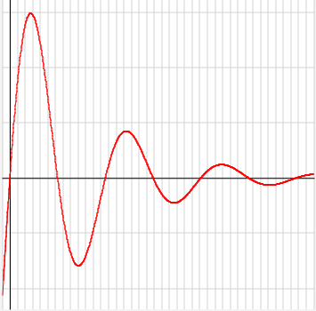
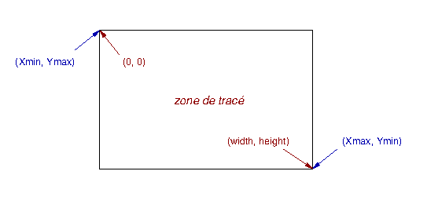

# Test d'IHM et langage Java

## Test du vendredi 12 juin 2018 – Durée 2 heures – Documents autorisés

Comme pour les TPs, vous commencerez par créer votre fork en cliquant sur ce lien :

[https://classroom.github.com/a/L0my8WfR](https://classroom.github.com/a/L0my8WfR)

L'objet de ce test est l'écriture en Java d'une IHM permettant de tracer la courbe d'une fonction de *x* sur un intervalle donné.

Par exemple, le tracé de la fonction `f(x) = exp(-x * 0.2) * sin(x)` sur l'intervalle [-0.5 ; 20] devrait ressembler à :



où, outre le tracé lui-même, nous pouvons voir sur cette image les 2 axes du repère (abscisses et ordonnées) ainsi qu'un quadrillage.

L'espacement entre 2 barres verticales du quadrillage et celui entre 2 barres horizontales sont tous deux déterminés par des paramètres qui seront modifiables via l'interface.
Sur l'exemple ci-dessus, ces espacements sont respectivement de 0.5 (en X) et 0.25 (en Y).

On peut aussi constater que l'échelle n'est pas respectée.
Elle dépend de l'intervalle (min et max) des abscisses mais aussi des ordonnées affichées et du ratio hauteur / largeur de la zone d'affichage.

Nous reviendrons plus loin dans l'énoncé sur les éléments à faire figurer sur votre IHM et dont dépend ce rendu.
La notation tiendra compte de la richesse de votre interface ainsi que sa présentation visuelle.

Rassurez-vous, vous avez à disposition plusieurs classes utilitaires vous affranchissant de l'écriture de la partie purement algorithmique de l'application.
Ainsi, vous avez principalement à vous concentrer sur la partie IHM.

### Les classes utilitaires

Toutes les classes utilitaires se trouvent dans le paquetage `fr.univ_amu.iut.utilitaires`. Il faudra donc les importer pour les utiliser.

#### La classe Analyseur

La classe `Analyseur` est chargée de l'analyse d'une chaîne contenant l'expresion de la fonction, telle que `"exp(-x * 0.2) * sin(x)"`, et de produire un objet `Expression` (voir ci-après) représentant cette expression.

Les seuls éléments publics de cette classe, que vous aurez à utiliser, sont :

+ son constructeur de signature `public Analyseur(String texte)` : il prend en paramètre la chaîne à analyser. 
Outre l'addition, la soustraction, la multiplication et la division, sont aussi acceptées les fonctions `exp`, `sin`, `cos` et `log` ;

+ sa méthode de signature `public Expression analyser() throws IOException, ErreurDeSyntaxe` 
qui analyse la chaîne donnée en argument du constructeur et renvoie l'objet `Expression` correspondant, ou lève une des exceptions mentionnées :
  + `IOException` s'il y a une erreur de lecture
  + `ErreurDeSyntaxe` si l'expression est mal formée

Remarque : vous devrez gérer la levée d'une exception éventuelle par la méthode `analyser()`, mais la forme sous laquelle l'information sera présentée à l'utilisateur est laissée libre.
Ici aussi, l'usage de composants graphiques adéquats seront plus appréciés dans la notation qu'un simple affichage sur la console ou l'absence de retour utilisateur.  

#### L'interface Expression

La seule chose que vous avez besoin de savoir à propos de l'objet retourné par la fonction `analyser()` ci-dessus est qu'il implémente l'interface `Expression`.
À ce titre, il fournit les 2 méthodes publiques suivantes :

+ `double valeur(double x)` qui retourne l'évaluation de l'expression pour la valeur de *x* donnée en paramètre.
 Par exemple, si `f` est l'objet `Expression` résultant de l'analyse de notre chaîne en exemple, alors `f.value(4)` renvoie environ `0.0313` ;

+ `String toString()` qui surcharge la méthode `toString()` de la classe `Object`, et qui renvoie une chaîne représentant la fonction de *x*.
En continuant notre exemple `f.toString()` renvoie la chaîne `"(exp(0.0 - ((x) * (0.2)))) * (sin(x))"` 

#### La classe ErreurDeSyntaxe

C'est une simple sous-classe de `Exception` dont le constructeur prend en paramètre une chaîne précisant l'erreur de syntaxe détectée par l'analyseur.
Vous n'aurez pas à créer des objets de cette classe, mais seulement à les utiliser si l'analyse lève une exception de ce type.

#### La classe Basic2DPoint

La petite classe utilitaire `Basic2DPoint` sert simplement à enregistrer les coordonnées (*x*, *y*) de points 2D qui sont passées en paramètres de son constructeur.
Deux *getters*, `getX()` et `getY()`, permettent de récupérer l'abscisse et l'ordonnée d'un point. 
*A priori*, vous n'aurez pas non plus besoin de créer vous-mêmes des objets de cette classe, mais vous en avez la possibilité si vous estimez que c'est pratique dans la réalisation de l'IHM.

#### La classe CalculateurPointsFonction

La classe `CalculateurPointsFonction` fournit un constructeur de signature :

```java
  public CalculateurPointsFonction(Expression f, double xMin, double xMax)
```
qui, à partir des paramètres qui lui sont communiqués, calcule la liste de 1001 objets `Basic2DPoint` successifs de la courbe de la fonction `f` dans l'intervalle [ `xMin` ; `xMax` ].
En d'autres termes, les points sont ordonnés sur les abscisses, qui vont de `xMin` (abscisse du premier point) à `xMax` (abscisse du dernier point), et chaque point `p` de la liste est tel que `p.getY()` contient `f.valeur(p.getX())`. 

Cette liste de points est enregistrée dans un `ArrayList` que l'on peut récupère avec la méthode publique `getListePoints()`. 
En outre, le constructeur calcule les valeurs min et max de la fonction sur l'ensemble de ces points, qui sont accessibles par les méthodes `getYMin()` et `getYMax()`.

### Travail à réaliser

#### Premier travail à réaliser : prise en mains des classes utilitaires

Avant de commencer le travail sur l'interface, il vous faut assimiler l'usage de ces classes utilitaires par un exercice simple.

Rendez la classe `CalculateurPointsFonction` exécutable en y ajoutant une méthode `main()` adéquate qui doit exploiter certaines classes utilitaires fournies afin :

+ d'analyser la chaîne `"exp(-x * 0.2) * sin(x)"`
+ afficher la chaîne produite par l'expression obtenue
+ afficher la liste des 1001 points de la courbe de la fonction correspondante sur l'intervalle [ -0.5 ; 20 ] sous la forme `f(x) = y`
+ afficher les valeurs min et max de la fonction sur cet intervalle 


#### Travail sur l'IHM

##### Préambule très important au travail à réaliser

Vous devez impérativement respecter à la lettre les consignes concernant les valeurs, les couleurs, les chaînes de caractères à afficher, les dimensions, etc...
Tous ces éléments seront testés de notre côté, donc toute erreur de votre part fera échouer nos tests.
Soyez particulièrement vigilants sur le respect de la casse dans les chaînes de caractères.
Toutefois il ne vous est pas demandé d'écrire de test.

Une méthode `setIds()` vous est fournie, vous devrez impérativement la compléter avec les identifiants des composants que vous ajoutez à l'interface.
Ceux-ci devront être définis comme des variables d'instance, et doivent avoir une visibilité package-private, ce qui signifie que vous devez les déclarer sans aucun mot-clé `public`/`private`/`protected` devant.
Par exemple, si vous choisissez de proposer un composant nommé `leNodePourLancerlAnalyse` qui lancera l'analyse de l'expression, la ligne de `setIds()` dont le texte est `votreIdentificateur.setId("demandeAnalyser");` sera modifiée en `leNodePourLancerlAnalyse.setId("demandeAnalyser");`. 
À chaque fois que vous définissez l'*id* d'un *node* dans cette méthode, vous sortirez la ligne correspondante de la zone de commentaires.

Vous utiliserez certainement d'autres composants que ceux mentionnés dans la méthode `setIds()`. 
Pour ceux-là, il n'y a aucun impératif, ni besoin d'ajouter de ligne dans cette méthode.

Nous vous conseillons de :
- réfléchir dans un premier temps à ce à quoi vous voulez que votre interface ressemble.
- ne pas viser trop complexe dans un premier temps étant donné le temps limité tout se réservant la possibilité de l'enrichir.
- ne pas rester pas bloqué longtemps sur un composant qui ne fonctionnerait pas complètement de façon optimale.
- travailler les différents éléments de façon indépendante.

##### Description de l'interface

Pour l'IHM dont il est question dans cette partie, **vous ne devez absolument pas utiliser FXML**.
Vous devrez utiliser la plupart des composants que nous avons vus en TP.

La fenêtre de votre interface doit avoir comme titre "Traceur de fonction", une largeur de 600px et une hauteur de 650px. 
Dans un premier temps, cette fenêtre ne doit pas être redimensionnable.

L'utilisateur de l'IHM commencera par saisir l'expression à analyser.
Vous proposerez par défaut l'expression "exp(-x * 0.2) * sin(x)".

À partir de cette expression, l'utilisateur peut demander à l'analyser.
Auquel cas, l'interface doit afficher le résultat de l'analyse, précédé de la chaîne "Expression analysée : f(x) = ".

Ainsi, pour l'exemple de "exp(-x * 0.2) * sin(x)", l'interface doit faire apparaître "Expression analysée : f(x) = (exp(0.0 - ((x) * (0.2)))) * (sin(x))".
Dans le cas où l'analyse échoue, l'interface doit faire apparaître l'échec. Ainsi, l'analyse de "si(x)" correspondra à "si : identificateur inconnu".

Par ailleurs l'utilisateur peut demander à tracer la fonction et le résultat du tracé apparaîtra dans la zone prévue à cet effet.
Non seulement vous aurez à tracer la courbe, mais aussi les deux axes d'un plan cartésien ainsi qu'un quadrillage de fond.
Le fond de la zone de tracé doit être de couleur "white" et les traits de quadrillage de couleur "lightgrey",
les deux axes restant à la couleur par défaut.

Avant de demander à tracer, l'utilisateur aura la possibilité :
- de choisir l'intervalle des valeurs en abscisse de la fonction qu'il veut faire tracer,

- de définir les espacements entre les lignes du quadrillage, aussi bien en abscisse qu'en ordonnée ; 
vous proposerez au minimum 2 façons différentes de régler ces valeurs, et, quel que soit le moyen choisi par l'utilisateur, toutes les valeurs sur l'interface doivent être correctement actualisées.
On admet que l'espacement entre 2 lignes verticales (en X) du quadrillage doit être réglable entre 0.5 et 2, et soit par défaut 0.5.
De même, l'espacement entre 2 lignes horizontales (en Y) du quadrillage doit être réglable entre 0.25 et 2, et soit par défaut 0.25.
Ces valeurs par défaut correspondent au quadrillage apparaissant dans l'exemple donné en début de sujet.


Une fois la fonction tracée, aucune modification de ces valeurs n'aura d'impact sur le tracé de la fonction.

Pour tracer, vous utiliserez la classe `CalculateurDePoints` qui vous fournira les points nécessaires pour tracer les (1000) segments successifs de la courbe, où chaque segment doit relier 2 points successifs.
Elle fournira aussi les valeurs min et max de la fonction sur l'intervalle donné.

Il faudra toutefois appliquer une transformation affine pour adapter les points à tracer au panneau dans lequel sera tracée la courbe.
Pas de panique ! Ces fonctions sont expliquées ci-dessous.

##### Transformations affines pour le changement de repère

Les points que produit `CalculateurDePoints` ont des coordonnées absolues, sans rapport avec la zone graphique qui les contient.
Cette zone a son propre repère, différent de celui des points, puisque dans cette zone le point de coordonnées (0, 0) se trouve toujours dans son coin haut gauche, quels que soient la fonction affichée et ses paramètres !

En particulier :

- le point de coordonnées absolues (`Xmin`, `Ymax`) a pour coordonnées (0, 0) dans la zone de tracé ;

- le point de coordonnées absolues (`Xmax`, `Ymin`) a pour coordonnées (*width*, *height*) dans la zone de tracé, où *width* et *height* sont la largeur et la hauteur de cette zone.

Ces changements de repère sont résumés dans la figure ci-dessous (en bleu les coordonnées absolues, et en rouge les coordonnées dans la zone de tracé) :



Il faut donc disposer des outils permettant de passer des coordonnées absolues (x<sub>a</sub>, y<sub>a</sub>) en coordonnées "écran" (x<sub>e</sub>, y<sub>e</sub>), ce qui se fait par l'application de 2 transformations affines :

+ x<sub>e</sub> = A<sub>x</sub> * x<sub>a</sub> + B<sub>x</sub>

+ y<sub>e</sub> = A<sub>y</sub> * y<sub>a</sub> + B<sub>y</sub>

avec les paramètres A<sub>x</sub>, B<sub>x</sub>, A<sub>y</sub> et B<sub>y</sub> des fonctions affines calculés par les formules : 

+ A<sub>x</sub> = *width* / (`xMax` - `xMin`)

+ B<sub>x</sub> = -A<sub>x</sub> * `xMin`

+ A<sub>y</sub> = -*height* / (`yMax` - `yMin`)

+ B<sub>y</sub> = -A<sub>y</sub> * `yMax`

Afin de simplifier votre code, vous devrez écrire les méthodes permettant de calculer ces paramètres A<sub>x</sub>, B<sub>x</sub>, A<sub>y</sub> et B<sub>y</sub>, ainsi que les méthodes permettant de passer d'un *x<sub>a</sub>* absolu en *x<sub>e</sub>* "écran", et d'un *y<sub>a</sub>* absolu en *y<sub>e</sub>* "écran".

Avant de calculer les paramètres des transformations affines, il peut être utile (sans être obligatoire) 
de réajuster les valeurs de `YMin` et `YMax`, si vous souhaitez conserver, sur le panneau du tracé, un espace en haut et bas du tracé. 
Par exemple, sur la courbe présentée plus haut, ces valeurs ont été ajustées de -/+ l'espacement en Y du quadrillage divisé par 4. 

Par ailleurs, l'utilisateur peut choisir :

- la couleur de la courbe, initialisée par défaut à "red". Vous pouvez utiliser pour cela un objet de la classe JavaFX `ColorPicker` (un sélecteur de couleur) ;

- l'épaisseur du tracé, initialisée par défaut à 1.

Si, une fois la courbe tracée, l'utilisateur change la couleur ou l'épaisseur, le tracé de la courbe doit aussi changer en conséquence.

Enfin, l'utilisateur doit pouvoir effacer le tracé, ce qui effacera non seulement la courbe mais aussi le quadrillage de fond.
Lorsqu'on demande à tracer une nouvelle fonction, le tracé actuel (s'il existe) sera effacé avant.


#### Troisième partie

##### FXML

Lorsque votre interface fonctionnera, vous isolerez la partie qui gère la "saisie" des espacements 
en X et en Y du quadrillage, pour en faire un composant écrit en FXML, ainsi que le contrôleur qui lui sera associé.
Vous conserverez le code que vous avez déjà écrit et que vous souhaitez remplacer en le plaçant dans une/des fonctions nommées de façon appropriée, de façon à ce que nous puissions retrouver les 2 versions de votre code.
Attention à ne pas perdre la première partie de ce travail !

##### Ajustement de texte

Si certaines de vos valeurs sont saisies dans des `TextField`, vous gérerez la transformation d'une saisie de la virgule en une saisie d'un point et vous interdirez toute saisie d'un caractère autre qu'un chiffre, point ou virgule.  

##### Redimensionnement de la fenêtre

Vous pouvez ensuite rendre la fenêtre de l'application redimensionnable, et travailler sur le redimensionnement en conséquence du panneau du tracé et de son contenu.

##### Tracé de plusieurs fonctions

Vous pouvez réfléchir à la possibilité de tracer plusieurs fonctions sur le même panneau. 
Dans ce cas, il sera sans doute nécessaire d'actualiser les valeurs de `YMin` et `YMax` pour tracer la nouvelle fonction ainsi que retracer le tracé existant.

##### Présentation visuelle et quartier libre

Vous devez soigner l'apparence de votre interface, en disposant les composants de façon élégante, avec des espacements adéquats.
Vous pouvez aussi rendre votre interface plus riche en ajoutant des fonctionnalités qui n'ont pas été imposées dans le sujet.

## Bon travail !