#  Introduction aux IHM en Java 

### IUT d’Aix-Marseille – Département Informatique Aix-en-Provence

* **Cours:** [M2105](http://cache.media.enseignementsup-recherche.gouv.fr/file/25/09/7/PPN_INFORMATIQUE_256097.pdf)
* **Responsable intérimaire:** [Cyril Pain-Barre](mailto:cyril.pain-barre@univ-amu.fr)
* **Responsable habituel:** [Sébastien NEDJAR](mailto:sebastien.nedjar@univ-amu.fr)
* **Enseignants actuels:** [Sophie Nabitz](mailto:sophie.nabitz@univ-avignon.fr), [Cyril Pain-Barre](mailto:cyril.pain-barre@univ-amu.fr)
* **Besoin d'aide ?**
    * La page [Piazza de ce cours](https://piazza.com/univ-amu.fr/spring2017/m2105/home).
    * Consulter et/ou créér des [issues](https://github.com/IUTInfoAix-M2105/tp1/issues).
    * [Email](mailto:sebastien.nedjar@univ-amu.fr) pour une question d'ordre privée, ou pour convenir d'un rendez-vous physique.

## TP 1 : Découverte de l'environnement de travail, des outils et premiers programmes en Java [](https://travis-ci.org/IUTInfoAix-M2105/tp1)

L'objectif premier de ce TP est de vous familiariser avec tous les nouveaux outils qui seront mis en oeuvre pendant ce cours. En plus de la réalisation d'IHM, ces TP seront la première occasion de se confronter à la gestion de version, au test unitaire et à des outils de gestion de cycle de vie logiciel comme Maven.


### Découverte et prise en main de l'IDE


Pendant les TP, les enseignants utiliseront comme environnement de développement intégré 
**[IntelliJ IDEA](https://www.jetbrains.com/idea/)** de chez **[JetBrains](https://www.jetbrains.com)**. Cet IDE 
spécialisé dans Java est celui qui aujourd'hui possède la meilleure intégration native d'outils comme Git, GitHub et Maven. 
Il devrait donc vous faciliter la vie au quotidien dans la réalisation de vos TP. Bien évidement, rien ne vous empêche 
d'en utiliser un autre mais attention dans ce cas là, vos enseignants attendront une totale autonomie vis à vis des 
problèmes de prise en main de votre IDE.

IntelliJ IDEA possède deux versions, la première dite *'communautaire'* est totalement open source et peut être utilisée 
gratuitement par n'importe qui et la seconde dite *'ultimate'* qui est plus riche en fonctionnalité et qui n'est pas 
gratuite pour les individus lambda. Par chance, en tant qu'étudiant dans une université française, vous avez la 
possibilité de pouvoir bénéficier d'une licence pour tous les produits JetBrains. En l'occurrence, puisque la version installée sur la VM est la version Ultimate 2020.1, il vous faudra acquérir (gratuitement) une licence en remplissant [ce formulaire](https://www.jetbrains.com/shop/eform/students).

Quelques minutes après, vous recevrez un email de confirmation suivi d'un second email d'activation ou vous devrez accepter 
les conditions d'utilisation et choisir un nom d'utilisateur et un mot de passe. Conservez précieusement ces 
informations dans un coin identifié de votre cerveau car c'est grâce à elle que vous pourrez importer votre licence 
sur d'autres produits JetBrains.

Ce qui suit correspond à une utilisation sous Linux principalement, mais est facilement transposable pour les installations Mac OS X et Windows 10.

#### Création de votre fork du TP1

Vous connaissez déjà les bases de Git. Si ce n'est pas le cas, il vous faudra réaliser le [TP Git](https://github.com/IUTInfoAix-M2103/tp1) ! 
Elles vous seront utiles pour commencer à travailler sur vos TP. Comme vous allez 
le découvrir le rendu, l'évaluation (éventuelle) et le suivi de votre travail passeront par GitHub. La première chose que vous allez 
donc faire est de créer un fork d'un dépôt. Pour ce faire, rendez-vous sur le lien suivant : 

[https://classroom.github.com/a/sq3xlG3c](https://classroom.github.com/a/sq3xlG3c) 

GitHub va vous créer un dépôt contenant un fork du dépôt 'IUTInfoAix-m2105/tp1' et s'appellant 'IUTInfoAix-m2105/tp1-votreUsername'. 
Vous apparaîtrez automatiquement comme contributeur de ce projet pour y pousser votre travail. Sachez qu'un robot 
récupérera automatiquement votre code après chaque *push* pour vérifier que les tests passent et calculer en même temps 
votre taux d'accomplissement du TP.

#### Lancement de l'IDE

Allez dans le Menu 'Application' puis 'Programmation' et ouvrir 'IntelliJ IDEA Ultimate Edition'. Acceptez la licence et faites votre choix concernant la transmission de données d'utilisation.

<!--
Après le chargement, vous devriez tomber sur une première fenêtre vous proposant d'importer vos paramètres.

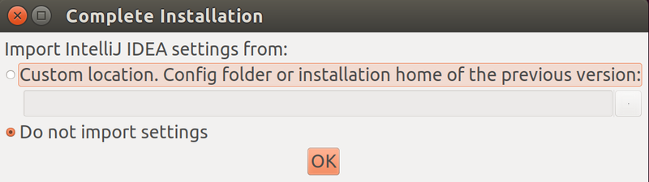

Laissez sur 'Do not import settings' et cliquez sur 'OK'. 
-->

À partir de là vous allez personnaliser votre installation 
pour qu'elle corresponde à vos besoins.

Sur la première fenêtre de personnalisation, vous devez choisir l’apparence de votre IDE. Ici rien de fondamental, vous 
pouvez choisir l'option que vous voulez. 

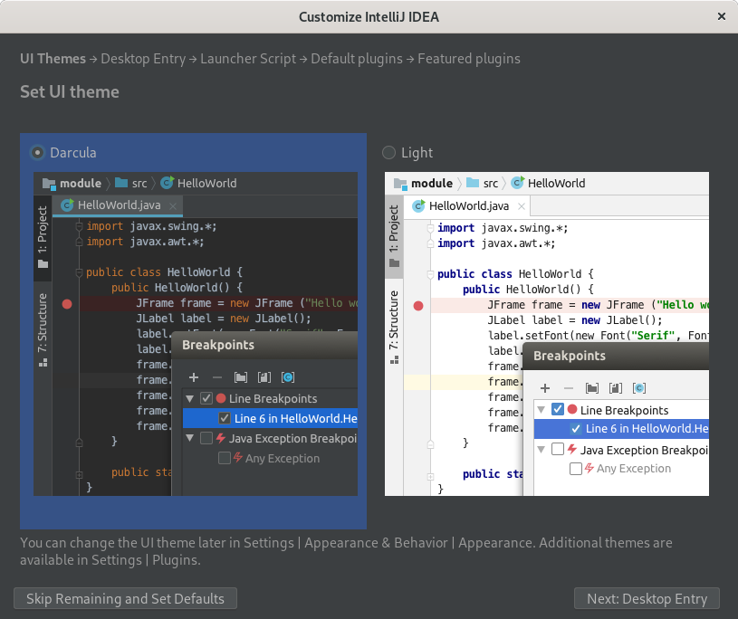

Les deux écrans suivants sont plutôt destinés à une installation sur une machine personnelle. Sur la VM vous pouvez laisser 
les options par défaut et passer à la suite.

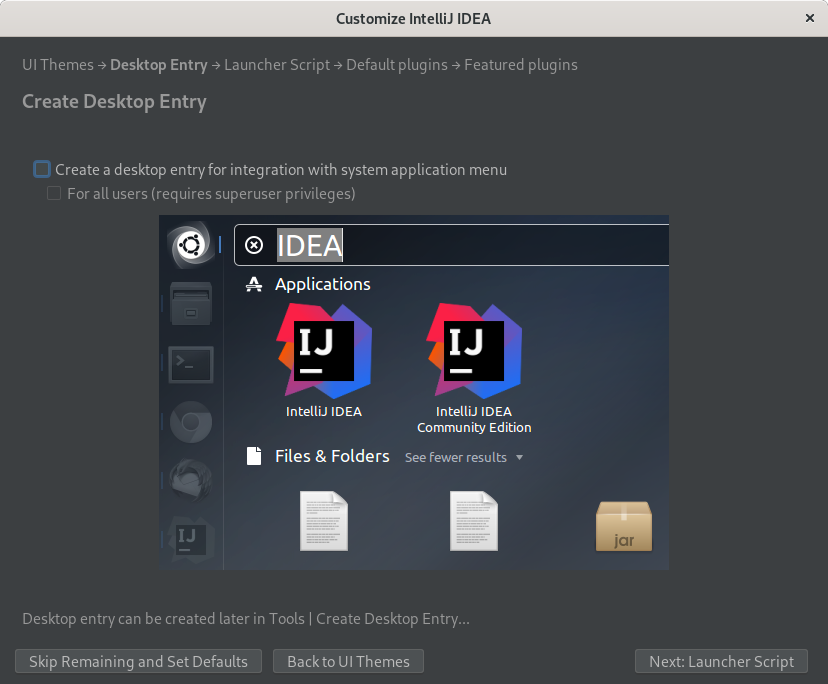
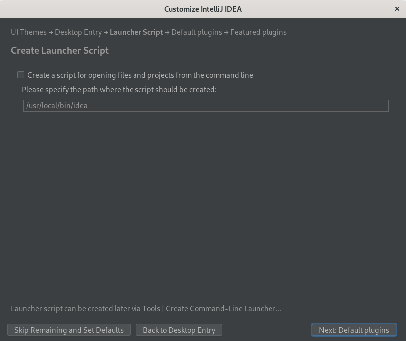

Un premier écran permet de choisir des plugins que vous allez activer. De manière générale, il vaut 
mieux en activer le moins possible pour éviter les mauvaises surprises.

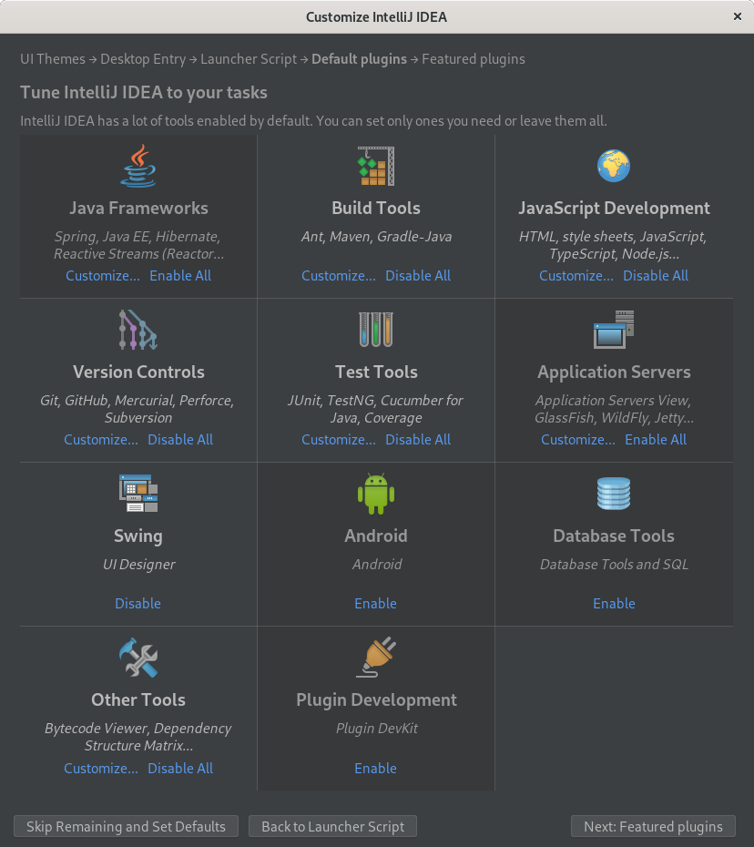

Voici la configuration que l'on vous conseille :
- **Java Framworks :** Aucun
- **Build Tools :** Maven
- **JavaScript Development :** Tous
- **Version Controls :** Git et Github
- **Test Tools :** Tous
- **Application Servers :** Aucun
- **Swing :** Activé
- **Android :** Désactivé
- **Database Tools :** Désactivé
- **Other Tools :** Tous
- **Plugin Development :** Désactivé

L'écran qui suit permet d'installer des plugins additionnels.

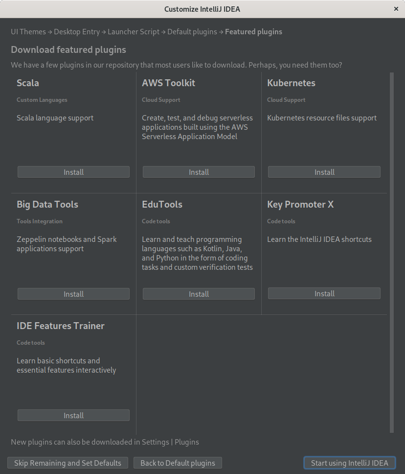

Aucun ne sera nécessaire (bien que EduTools n'est sûrement pas dénué d'intérêt...).

Il ne reste plus qu'à saisir vos données de connexion pour terminer le paramétrage de votre IDE.


#### Import du projet dans l'IDE

Pour pouvoir maintenant travailler sur votre TP, il vous faut cloner votre dépôt GitHub et l'importer dans 
l'IDE.

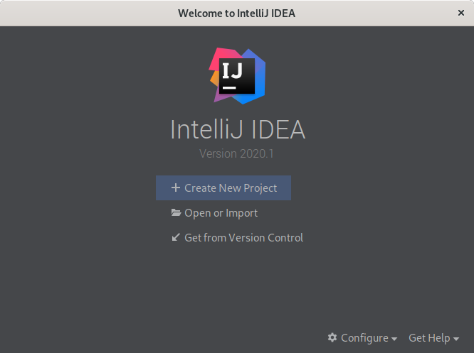

Pour ce faire cliquez sur 'Get from Version Control' puis sur 'GitHub'. Vous allez arriver sur 
la fenêtre de connexion à GitHub.

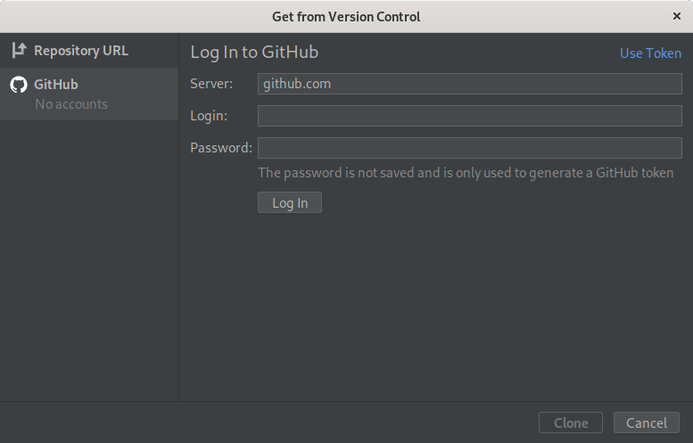

Renseignez votre nom d'utilisateur GitHub et votre mot de passe. Cela va générer un token sur votre compte GitHub qui vous authentifiera désormais sur GitHub depuis IntelliJ IDEA. Vous recevrez probablement un mail de la part de GitHub pour vous en informer.

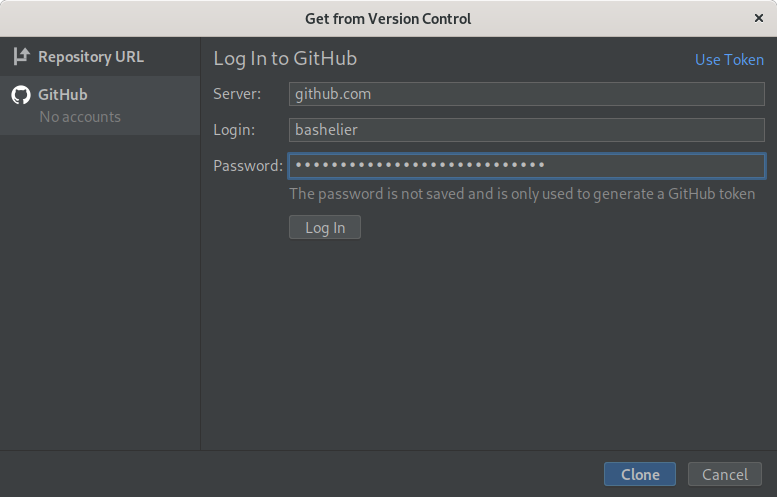

La liste de vos dépôts GitHub devrait appaître. Ici sélectionnez votre fork du TP1 qui devrait avoir un nom de la 
forme 'IUTInfoAix-m2105/tp1-votreUsername'. Mémorisez bien le dossier dans lequel vous clonez votre projet. Vous aurez besoin d'y accéder par la suite en ligne de commande pour soumettre vos changement et les pousser en ligne.

En cas de difficulté à retrouver votre fork du TP, vous pouvez simplement en indiquer l'URL dans la barre du haut. Cette URL est celle obtenue sur le site GitHub du dépôt en cliquant sur 'Clone or download' (le bouton vert à droite) et en choisissant 'Clone with HTTPS'.

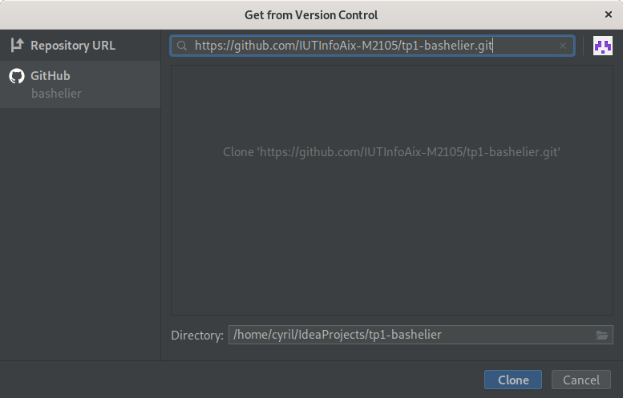

Après avoir cliquer sur 'Clone', le clonage du TP1 commence.

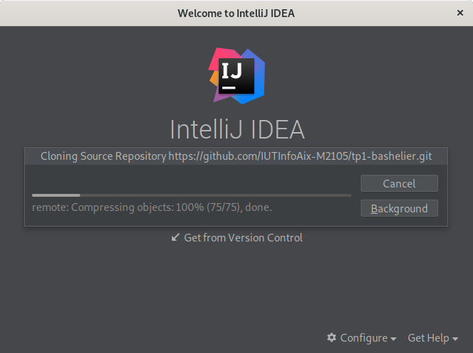

*ItelliJ IDEA* devrait détecter que votre projet possède un fichier `pom.xml`, et importer toutes les dépendances du projet. Cela peut prendre un peu de temps. 

#### Découverte de l'IDE
Lorsque vous ouvrez votre projet, vous arrivez sur une fenêtre comme celle-ci :

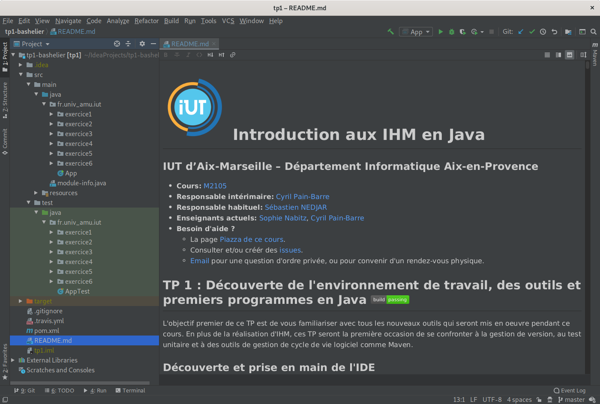

où la vue projet devrait être déjà développée et le (ce !) fichier `README.md` affiché.

Si ce n'est pas le cas, passer la souris sur l’icône représentant une carré en bas à gauche et sélectionnez 'Project' pour avoir la vue de votre projet.

Dans cette vue, vous pouvez voir les différents dossiers de votre projet. Pour le TP, vous travaillerez 
principalement dans deux d'entre eux : 

- `src/main/java/fr/univ_amu/iut/` : Qui contiendra l'ensemble du code applicatif (le code des exercices).
- `src/test/java/fr/univ_amu/iut/` : Qui contient les classes de test associées (le code vous aidant à vérifier votre solution).

Notez qu'IDEA regroupe sur l'interface `fr/univ_amu/iut` en `fr.univ_amu.iut` car les répertoires `fr` et `univ_amu` ne contiennent qu'un seul élément. Vous pouvez utiliser un terminal ou l'explorateur de fichiers du système (nautilus) pour explorer plus en détail l'arborescence de votre projet :

```
~/IdeaProjects$ tree tp1-bashelier/ -I 'target*|resources*'
tp1-bashelier/
├── pom.xml
├── README.md
├── src
│   ├── main
│   │   └── java
│   │       ├── fr
│   │       │   └── univ_amu
│   │       │       └── iut
│   │       │           ├── App.java
│   │       │           ├── exercice1
│   │       │           │   └── HelloWorld.java
│   │       │           ├── exercice2
│   │       │           │   └── FizzBuzzer.java
│   │       │           ├── exercice3
│   │       │           │   └── ConvertisseurDeNombreRomain.java
│   │       │           ├── exercice4
│   │       │           │   ├── GridPosition.java
│   │       │           │   ├── Movement.java
│   │       │           │   ├── Orientation.java
│   │       │           │   ├── Robot.java
│   │       │           │   └── RobotSimulator.java
│   │       │           ├── exercice5
│   │       │           │   └── MinesweeperBoard.java
│   │       │           └── exercice6
│   │       │               ├── ArgsException.java
│   │       │               ├── Args.java
│   │       │               └── ArgsMain.java
│   │       └── module-info.java
│   └── test
│       └── java
│           └── fr
│               └── univ_amu
│                   └── iut
│                       ├── AppTest.java
│                       ├── exercice1
│                       │   └── HelloWorldTest.java
│                       ├── exercice2
│                       │   └── FizzBuzzTest.java
│                       ├── exercice3
│                       │   └── ConvertisseurDeNombreRomainTest.java
│                       ├── exercice4
│                       │   └── RobotTest.java
│                       ├── exercice5
│                       │   └── MinesweeperBoardTest.java
│                       └── exercice6
│                           ├── ArgsExceptionTest.java
│                           └── ArgsTest.java
└── tp1.iml

23 directories, 25 files
```

#### Exécution de la classe App

Cette classe principale `App` du package `fr.univ_amu.iut` n'est qu'une classe "témoin" pour s'assurer que tout fonctionne normalement. Ouvrez la dans IDEA et observez son code :

```java
package fr.univ_amu.iut;

/**
 * Hello world!
 *
 */
public class App 
{
    public static void main( String[] args )
    {
        System.out.println("Affichage des arguments de la ligne de commande :");
        for (String arg : args) {
            System.out.println(arg);
        }
    }
}
```

On retrouve :

- l'instruction `package` indiquant à quel package appartient la classe

- l'instruction `public class App` commençant la définition de la classe. Notez que le fichier qui la contient doit avoir le même nom, avec l'extension `.java` ;

- la définition de la méthode **publique** et **statique** `main` prenant en paramètres un tableau de `String` qui en fait une **classe exécutable** (la signature est stricte ; une méthode `main` qui n'aurait pas cette signature ne rendrait pas la classe exécutable). Dans cette méthode :

  - l'instruction `System.out.println()` permet d'afficher un message sur la console en allant à la ligne ;
  
  - la boucle `for` est une boucle de type *foreach* qui permet de parcourir le tableau de `String` en attribuant à la variable `arg` un nouvel élément du tableau à chaque intération ;
  
  - une nouvelle instruction `System.out.println()` qui affiche l'élément courant

En principe, le système et l'IDE sont prêts à fonctionner avec le JDK (Java Development Kit) OpenJDK-11. 
Il ne devrait pas être nécessaire de modifier les paramètres du projet ou d'IDEA pour exécuter la classe principale `App.java` qui devrait apparaître avec l'icône  (icône de classe avec triangle vert) indiquant qu'on peut l'exécuter. Pour ce faire, dans la vue 'Project' effectuez un clic droit sur `App` et choisir Run 'App.main()'.

En bas de la fenêtre, vous devriez voir le résultat de l'exécution de cette classe sur la console d'exécution :

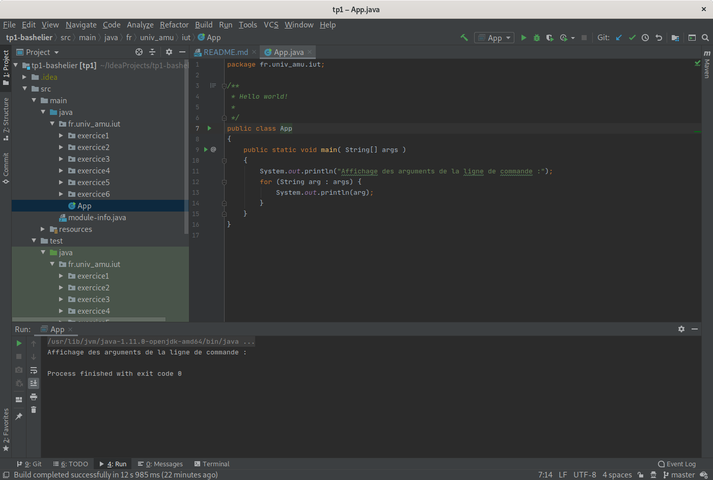

Puisque nous n'avons pas fourni d'argument à l'exécution de la classe, la boucle n'affiche rien. Pour en donner sans passer par la ligne de commandes, il faut passer par le menu 'Run' puis 'Edit Configurations...' (ou clic droit sur la classe et 'Edit App.main()...' pour ouvrir un menu similaire) et saisir les arguments dans la zone 'Program arguments:' :

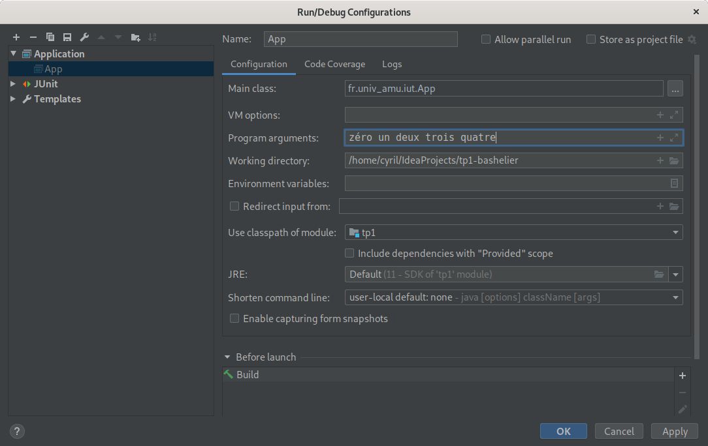

puis valider. Une nouvelle exécution de `App` affichera sur la console  :

```
Affichage des arguments de la ligne de commande :
zéro
un
deux
trois
quatre
```

#### En cas de complications

Il se peut que tout ne se déroule pas comme prévu et que vous ne parveniez pas à exécuter `App`, en particulier si vous utilisez votre propre installation.

Si le triangle vert n'apparaît pas sur le nom de cette classe, il se peut que le projet n'ait pas été correctement importé comme un projet maven (un outil de gestion du cycle de vie d'une application). Dans ce cas faire un clic droit sur le fichier `pom.xml` puis sélectionner 'Maven' puis 'Reimport' (ou 'Import as a maven project').

Si ça ne règle pas le problème, il se peut que IDEA ne trouve pas le JDK (SDK) si l'installation n'a pas été correctement réalisée. Aller dans le menu 'File' puis 'Project Structure' et :
  - dans la partie 'Project SDK' de 'Project Settings', vérifiez que vous utilisez une version de développement java version 11 ou supérieure (le niveau de language est au minimum 8, mais 11 est aussi un bon choix)
  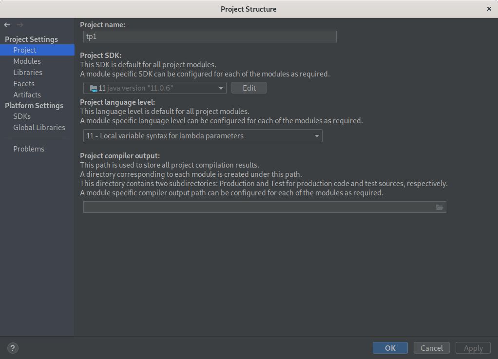

  - dans la partie 'SDKs' de 'Platform Settings', 11 doit apparaître avec son JDK home path, sinon ajouter manuellement le JDK que vous avez installé :
  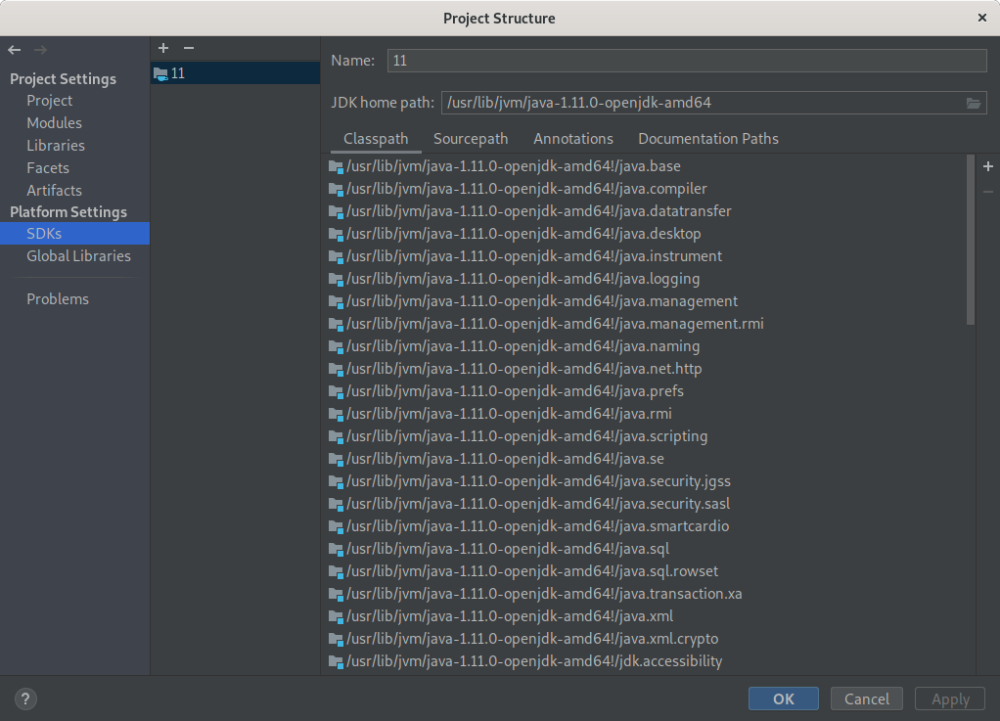


### Mode opératoire du TP (Workflow)

<!--
Maintenant que vous savez utiliser Git en ligne de commande, que vous avez forké, importé et ouvert le TP dans votre IDE, 
vous êtes en capacité de travailler sur vos exercices. 
-->

Ce TP est conçu pour vous faire découvrir le **Test Driven Development (TDD)**, c'est à dire le développement conduit par les tests.

Le TDD est une méthode de conception émergente selon laquelle la conception apparaît au fur et à mesure du 
développement en encourageant une meilleure compréhension du problème **en commençant à écrire les tests avant le code 
applicatif**. Pour le développeur, les tests vont constituer une spécification technique exécutable et vérifiable à tout 
moment. Ainsi en rajoutant des tests, le développeur converge progressivement à la fois vers une spécification plus fine 
et un code fonctionnel associé.

Le workflow du TDD est souvent décrit par le triptyque "RED, GREEN, REFACTOR" (figure empruntée au site [ministryoftesting](https://www.ministryoftesting.com)) :

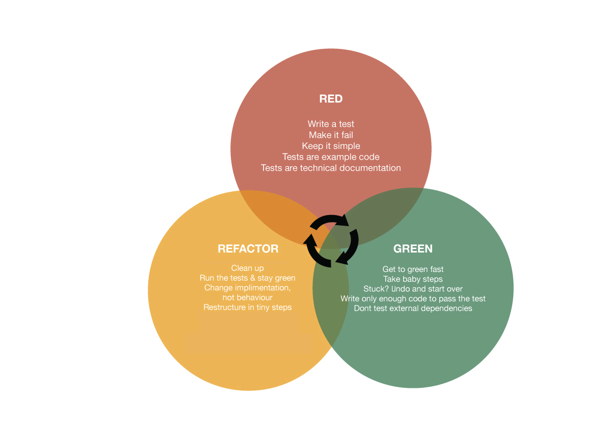

Nous vous proposons de suivre ce workflow particulier pour résoudre vos exercices progressivement et en consolidant 
progressivement un filet de sécurité qui vérifiera que votre code continue à bien faire ce qu'il doit.
Pour vous faciliter la tâche, les tests vous sont 
donnés pour vous faire découvrir cette méthode sans trop de douleur.

#### Première exécution d'un test

Avant de vous présenter plus précisément ce que vous devez réaliser dans le contexte du TDD, commençons par exécuter un premier test, presqu'aussi inutile que notre classe `App` car il est censé ne jamais échouer, mais nous permettant de vérifier que les tests aussi sont fonctionnels.

Ouvrez le fichier `AppTest.java`, présent dans `src/test/java/fr/univ_amu/iut` :

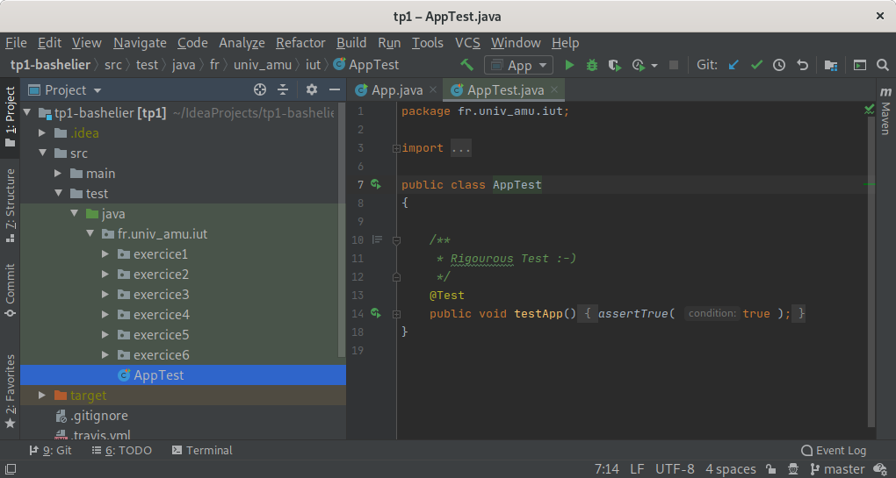

Il contient un seul test `testApp()` qui s'assure que `true` est toujours vrai...
La classe `AppTest` devrait être reconnue comme une classe de tests unitaires et apparaître avec l'icône  ajoutant un triangle rouge à celle des classes exécutables.

Pour exécuter ce test, utiliser l'icône vert  (ou comme ici   ou encore , voir ci-après) dans la marge à gauche du code de la méthode, et sélectionner Run 'testApp()'. En bas de la fenêtre devrait s'afficher le résultat du test passé avec succès ayant une marque verte  :

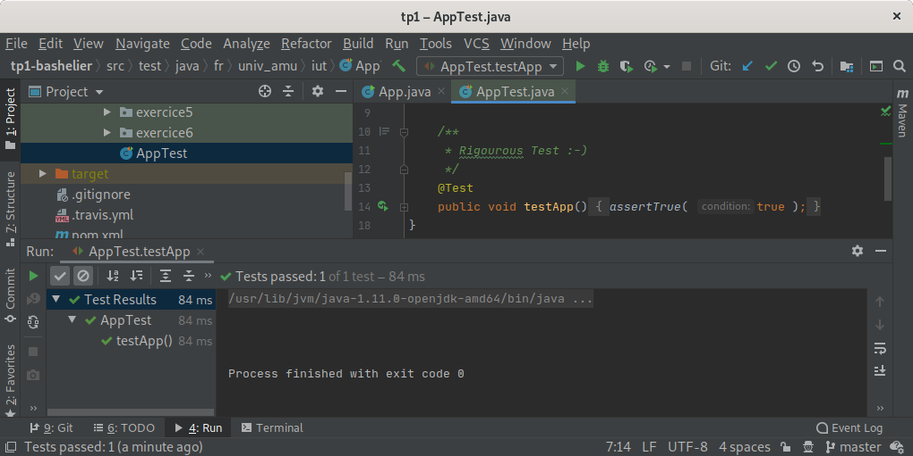

Et dans la marge du code de la méthode `testApp()` devrait apparaître l'icône .

Quand une classe de test possède plusieurs méthodes de test, on peut les exécuter tous en cliquant sur l'icône  puis en choisissant d'exécuter la classe entière.

Si un test échoue, son résultat sera écrit en rouge avec le marqueur  et la marge du code de la méthode correspondante aura l'icône . Un double clic sur le test vous ramènera sur son code.

Certains tests peuvent être momentanément désactivés car leur méthode est préfixée de l'annotation `@Disabled`. Dans ce cas, le test est ignoré et apparaît avec la marque .
Pour activer le test, il faut mettre en commentaire l'annotation `@Disabled` ou la supprimer.

Enfin, quand il existe plusieurs classes de test regroupées comme ici dans l'arborescence `src/test/java`, il est possible de faire exécuter la totalité de tous les tests (non désactivés) en faisant un clic droit sur le dossier java  et en choisissant Run 'All Tests'...

#### Étapes du cycle principal

Au cours du TP, vous devrez donc opérer en TDD. Chaque exercice sera accompagné d'au moins une classe de test, dont tous les tests sont initialement désactivés. Pour réaliser l'exercice vous devrez suivre cycliquement les étapes suivantes (indiquées dans la figure précédente, illustrant le TDD) : 

1. **RED :** Dans cette étape, vous devez activer un test en enlevant le `@Disabled` devant la méthode de test (ou en la décommentant). Une fois 
le test activé, vous devez le lancer pour vérifier qu'il échoue. Un test qui n'échoue jamais (comme celui de `AppTest`) ne teste rien donc il ne 
sert à rien.

1. **GREEN :** Ici vous devez écrire le moins de code possible pour faire passer le test en question. Quand vous pensez 
avoir terminé, vous relancez le test en question pour vérifier que le code est juste. Si tel est le cas, vous lancez tous 
les autres tests pour vous assurer que votre implémentation n'a rien cassé.

1. **REFACTOR :** Maintenant que votre couverture de test est au vert, vous pouvez transformer votre code pour le nettoyer, 
le restructurer et l'améliorer sans en changer le comportement. Pendant cette étape, les tests doivent être continuellement 
au vert. Ils jouent le rôle de filet de sécurité pour éviter l'introduction d'une régression dans le code. Quand tout 
est terminé vous pouvez redémarrer le cycle avec un prochain test.

**À chaque fin de cycle, vous devez soumettre votre travail sur votre dépôt Git local et le pousser sur votre fork sur 
GitHub. Vous terminez un exercice lorsque tous les tests y sont activés et passent sur votre dépôt distant.**

IntelliJ IDEA vous permet de "commiter" votre code et de le "pousser" sur GitHub directement depuis l'IDE, sans passer par la ligne de commande, soit via la partie 'Git' de la barre d'outils, soit par le menu 'VCS' puis 'Git'. Généralement l'action 'commit' vous propose d'écrire le commentaire du *commit*, ainsi qu'une option 'Commit and Push...'.

#### Ligne de commandes

La méthode recommandée pour réaliser ces TP est de rester simplement sur IDEA pour exécuter, tester et versionner votre travail. Néanmoins, nous tenons à signaler que l'architecture de votre projet repose sur l'outil **maven** pour lequel a été défini le fichier `pom.xml` à la racine du projet, et qui a permis à IntelliJ IDEA de l'analyser correctement.

Maven est un outil puissant permettant de gérer l'ensemble du cycle de vie d'une application : nettoyage, vérification, compilation, tests, packaging, installation, déploiement...

Sans rentrer dans les détails, on peut exécuter la classe principale du TP via la ligne de commandes. La commande ci-dessous demande de nettoyer (`clean`) puis compiler le projet (`compile`), puis d'exécuter la classe principale (`exec:java`) :

```
~/IdeaProjects/tp1-bashelier$ mvn clean compile exec:java
WARNING: .... il y a ici d'éventuels Warning supprimés car sans intérêt pour le TP
[INFO] Scanning for projects...
[INFO] 
[INFO] ------------------------< fr.univ_amu.iut:tp1 >-------------------------
[INFO] Building tp1 1.0-SNAPSHOT
[INFO] --------------------------------[ jar ]---------------------------------
[INFO] 
[INFO] --- maven-clean-plugin:2.5:clean (default-clean) @ tp1 ---
[INFO] Deleting /home/cyril/IdeaProjects/tp1-bashelier/target
[INFO] 
[INFO] --- maven-resources-plugin:2.6:resources (default-resources) @ tp1 ---
[INFO] Using 'UTF-8' encoding to copy filtered resources.
[INFO] Copying 35 resources
[INFO] 
[INFO] --- maven-compiler-plugin:3.8.0:compile (default-compile) @ tp1 ---
[INFO] Changes detected - recompiling the module!
[INFO] Compiling 14 source files to /home/cyril/IdeaProjects/tp1-bashelier/target/classes
[INFO] 
[INFO] --- exec-maven-plugin:1.6.0:java (default-cli) @ tp1 ---
Affichage des arguments de la ligne de commande :
[INFO] ------------------------------------------------------------------------
[INFO] BUILD SUCCESS
[INFO] ------------------------------------------------------------------------
[INFO] Total time:  4.481 s
[INFO] Finished at: 2020-04-25T15:25:01+02:00
[INFO] ------------------------------------------------------------------------
```

De même, on peut exécuter l'ensemble des tests du projet via maven :

```
~/IdeaProjects/tp1-bashelier$ mvn test
WARNING: .... il y a ici d'éventuels Warning supprimés car sans intérêt pour le TP
[INFO] Scanning for projects...
[INFO] 
[INFO] ------------------------< fr.univ_amu.iut:tp1 >-------------------------
[INFO] Building tp1 1.0-SNAPSHOT
[INFO] --------------------------------[ jar ]---------------------------------
[INFO] 
[INFO] --- maven-resources-plugin:2.6:resources (default-resources) @ tp1 ---
[INFO] Using 'UTF-8' encoding to copy filtered resources.
[INFO] Copying 35 resources
[INFO] 
[INFO] --- maven-compiler-plugin:3.8.0:compile (default-compile) @ tp1 ---
[INFO] Nothing to compile - all classes are up to date
[INFO] 
[INFO] --- maven-resources-plugin:2.6:testResources (default-testResources) @ tp1 ---
[INFO] Using 'UTF-8' encoding to copy filtered resources.
[INFO] skip non existing resourceDirectory /home/cyril/IdeaProjects/tp1-bashelier/src/test/resources
[INFO] 
[INFO] --- maven-compiler-plugin:3.8.0:testCompile (default-testCompile) @ tp1 ---
[INFO] Nothing to compile - all classes are up to date
[INFO] 
[INFO] --- maven-surefire-plugin:3.0.0-M4:test (default-test) @ tp1 ---
[INFO] 
[INFO] -------------------------------------------------------
[INFO]  T E S T S
[INFO] -------------------------------------------------------
[INFO] Running fr.univ_amu.iut.exercice5.MinesweeperBoardTest
[WARNING] Tests run: 15, Failures: 0, Errors: 0, Skipped: 15, Time elapsed: 0.089 s - in fr.univ_amu.iut.exercice5.MinesweeperBoardTest
[INFO] Running fr.univ_amu.iut.exercice3.ConvertisseurDeNombreRomainTest
[WARNING] Tests run: 21, Failures: 0, Errors: 0, Skipped: 21, Time elapsed: 0.048 s - in fr.univ_amu.iut.exercice3.ConvertisseurDeNombreRomainTest
[INFO] Running fr.univ_amu.iut.exercice6.ArgsTest
[WARNING] Tests run: 18, Failures: 0, Errors: 0, Skipped: 18, Time elapsed: 0.048 s - in fr.univ_amu.iut.exercice6.ArgsTest
[INFO] Running fr.univ_amu.iut.exercice2.FizzBuzzTest
[WARNING] Tests run: 11, Failures: 0, Errors: 0, Skipped: 11, Time elapsed: 0.033 s - in fr.univ_amu.iut.exercice2.FizzBuzzTest
[INFO] Running fr.univ_amu.iut.exercice4.RobotTest
[WARNING] Tests run: 23, Failures: 0, Errors: 0, Skipped: 23, Time elapsed: 0.061 s - in fr.univ_amu.iut.exercice4.RobotTest
[INFO] Running fr.univ_amu.iut.AppTest
[INFO] Tests run: 1, Failures: 0, Errors: 0, Skipped: 0, Time elapsed: 0.056 s - in fr.univ_amu.iut.AppTest
[INFO] Running fr.univ_amu.iut.exercice1.HelloWorldTest
[INFO] Tests run: 4, Failures: 0, Errors: 0, Skipped: 0, Time elapsed: 0.05 s - in fr.univ_amu.iut.exercice1.HelloWorldTest
[INFO] 
[INFO] Results:
[INFO] 
[WARNING] Tests run: 93, Failures: 0, Errors: 0, Skipped: 88
[INFO] 
[INFO] ------------------------------------------------------------------------
[INFO] BUILD SUCCESS
[INFO] ------------------------------------------------------------------------
[INFO] Total time:  7.461 s
[INFO] Finished at: 2020-04-25T15:28:13+02:00
[INFO] ------------------------------------------------------------------------
```

Si à la fin vous voyez apparaître une ligne avec `BUILD SUCCESS` c'est que tout s'est bien passé et 
que votre projet est dans un état assez satisfaisant pour être poussé en ligne.

### Exercice 1 : Hello world !

Exercice d'introduction classique. Dites simplement "Hello world!"

"Hello world" est le premier programme traditionnel pour commencer la programmation dans un nouveau langage ou 
un nouvel environnement.

#### Les objectifs sont simples:
- vous devez activer les tests un par un.
- Commencez par le premier, il doit échouer, implémentez ensuite la fonction de façon à ce qu'elle retourne `null`. Faites à nouveau tourner le test, il doit échouer. Puis implémentez la fonction pour qu'elle retourne "Hello, World!". Faites à nouveau tourner le test, il doit réussir.
- Vous recommencez ensuite cette étape pour chacun des tests suivants, mais chaque fois que vous modifiez quoi que soit dans la classe `HelloWorld`, vous n'oublierez pas de vérifier que tous les tests activés passent.
- Poussez votre solution sur GitHub.
- Si tout va bien, vous serez prêt à travailler enfin sur votre premier exercice réel.

Bien évidemment l'implémentation qui vous est demandée n'est pas canonique mais elle illustre sur un exemple très simple 
ce qui vous sera demandé dans la suite des exercices. N'oubliez pas le workflow et surtout de ne passer à l'exercice 
suivant qu'après avoir activé tous les tests les uns après les autres.

Une fois l'exercice terminé, n'oubliez pas de pousser vos modifications sur votre fork, soit simplement depuis IDEA via la barre d'outils Git ou le menu VCS, soit en ligne de commandes de la manière suivante : 
```sh
~/.../tp1-VotreUsername (master*)$ mvn test
~/.../tp1-VotreUsername (master*)$ git add src/test/java/fr/univ_amu/iut/exercice1/HelloWorldTest.java
~/.../tp1-VotreUsername (master*)$ git add src/main/java/fr/univ_amu/iut/exercice1/HelloWorld.java
~/.../tp1-VotreUsername (master*)$ git commit -m "Validation du dernier test de l'exercice 1"
~/.../tp1-VotreUsername (master)$ git push origin master
```

### Exercice 2 : Fizz Buzz !

Le jeu du Fizz Buzz est un jeu sympa à organiser lors d’un anniversaire avec des enfants.

**But du jeu** : Les enfants doivent essayer de remplacer les nombres multiples de trois et cinq respectivement par les 
mots fizz et buzz : "Fizz" correspond aux multiples de "3" et "Buzz" aux multiples de "5".

**Déroulement du jeu** : Les enfants sont organisés en cercle. Vous désignez un premier enfant qui prononce le chiffre 
"un" à voix haute. Son voisin de gauche poursuit en prononçant le chiffre "deux". On continue ainsi jusqu’à ce que l’on 
arrive à un nombre multiple de 3 ou de 5. Le premier piège se situe donc au chiffre 3. L’enfant dont c’est le tour, 
devra donc dire "fizz" et non "trois".

Voici un exemple de série détaillée jusqu’à 20 :

1 ; 2 ; Fizz ; 4 ; Buzz ; Fizz ; 7 ; 8 ; Fizz ; Buzz ; 11 ; Fizz ; 13 ; 14 ; FizzBuzz ; 16 ; 17 ; Fizz ; 19 ; Buzz ;

Un enfant qui se trompe deux fois est éliminé.

#### L'objectif de cet exercice est :
- d'implémenter une classe `FizzBuzzer` qui vous permettra de générer toute la série 'FizzBuzz' jusqu'à une valeur 
passée en paramètre. 

Comme pour l'exercice précédent, vous devez activer les tests les uns après les autres et soumettre votre solution après 
chaque itération du cycle principal du workflow.

Pas à pas :
- activez le premier test qui appelle la méthode computeString avec la valeur 1 fournie en paramètre, implémentez la méthode en retournant la chaîne "0", testez : le test échoue (RED)
- implémentez maintenant la méthode pour qu'elle retourne la chaîne "1", testez : le test réussit (GREEN)
- refaites les deux précédentes étapes avec le second test (RED puis GREEN)
- à ce niveau votre implémentation doit contenir un if, et vous devez remarquer que les deux "return" font la même chose, vous pouvez donc améliorer votre code pour qu'il retourne la chaîne résultat d'une conversion. C'est le premier REFACTOR.
- activez ensuite le test pour 3 (attention pas modulo 3), implémentez avec une valeur de retour fausse, puis une valeur de retour juste,
- vérifiez que votre code fonctionne en activant le test pour 4,
- activez ensuite le test pour 5 (attention pas modulo 5), implémentez la méthode (un if doit suffire),
- ajoutez maintenant au début de votre méthode la ligne suivante : `if (i==5) return "0";`, constatez et corrigez,
- activez ensuite le test pour 6 (attention pas modulo 3), implémentez avec une valeur de retour fausse, puis une valeur de retour juste,
- à ce niveau vous devez remarquer que vous avez deux fois la même ligne de code (return Fizz). Comme le code ne doit jamais être dupliqué (principe de base en conception), c'est le moment de refactorer.
- vérifiez que votre code fonctionne en activant le test pour 9,
- activez ensuite le test pour 10, implémentez avec une valeur de retour fausse, puis la valeur de retour juste,
- activez ensuite le test pour 15, qui doit d'abord échouer (sans aucune intervention), et ensuite écrivez le code correct.
- vérifiez pour 0.
- pour l'implémentation de la seconde fonction, conservez le même principe : vous pouvez commenter les lignes 79 à 82 pour continuer à implémenter suivant ce principe incrémental. 
- le dernier test est uniquement un test de vérification, vous ne devriez rien avoir à implémenter de plus.


### Exercice 3 : Convertisseur de nombre romain

La numération romaine est un système de numération additive utilisé par les Romains de l'Antiquité. Les chiffres romains 
sont représentés à l'aide de symboles combinés entre eux, notamment par les signes I, V, X, L, C, D et M, représentant 
respectivement les nombres 1, 5, 10, 50, 100, 500 et 1 000. 

Un nombre écrit en chiffres romains se lit de gauche à droite. En première approximation, sa valeur se détermine en 
faisant la somme des valeurs individuelles de chaque symbole, sauf quand l'un des symboles précède un symbole de 
valeur supérieure ; dans ce cas, on soustrait la valeur du premier symbole au deuxième.

#### L'objectif de cet exercice est :
- Écrire une classe `ConvertisseurDeNombreRomain` qui aura une fonction qui prendra en paramètre un nombre romain et 
retournera sa représentation en une valeur entière.

#### Indications :
Les nombres romains sont majoritairement représentés selon les principes suivants :
- Un nombre en chiffres romains se lit de gauche à droite ;
- Un même symbole n'est pas employé quatre fois de suite (sauf M) ;
- Tout symbole qui suit un symbole de valeur supérieure ou égale s’ajoute à celui-ci (exemple : 6 s'écrit VI) ;
- Tout symbole qui précède un symbole de valeur supérieure se soustrait à ce dernier ;
  * I doit être retranché à V ou à X quand I est devant V ou X}} (ex. : 4 s'écrit IV),
  * X doit être retranché à L ou à C quand X est devant L ou C (ex. : 40 s'écrit XL),
  * C doit être retranché à D ou à M quand C est devant D ou M (ex. : 900 s'écrit CM),
  * Par contre, ôter I de L ou de C n'est pas pratiqué (49 s'écrit XLIX et non IL ; 99 s'écrit XCIX et pas IC) ;
- Les symboles sont groupés par ordre décroissant, sauf pour les valeurs à retrancher selon la règle précédente 
(ex. : 1030 s'écrit MXXX et non XXXM qui est une des façons de représenter 970).

Dans cet exercice, vous allez pour la première fois, manipuler la classe [`String`](https://docs.oracle.com/en/java/javase/11/docs/api/java.base/java/lang/String.html). Cette classe possède de nombreuses méthodes utilitaires pour manipuler facilement les chaines de caractères. Prennez un peu de temps pour survoler la documentation avant de commencer la résolution de cet exercice. Ici, vous utiliserez principalement une boucle `for` et la méthode `charAt(i)` qui retourne le i-ème caractère d'une chaine.

Faites très attention pour cet exercice de bien respecter le principe du TDD en ajoutant vraiment tout le temps la quantité minimale de code nécessaire à la validation des tests. Si vous suivez cette règle, il se résout très facilement alors qu'en l'abordant de manière générale, il comporte de nombreux pièges pouvant vous faire perdre un temps précieux.

Comme pour l'exercice précédent, vous devez activer les tests les uns après les autres et soumettre votre solution après 
chaque itération du cycle principal du workflow.
Après le troisième test, vous pouvez refactorer en utilisant un switch. Ensuite, vous ajouterez les tests nécessaires pour les symboles L, C, D et M.
A la fin de l'implémentation de tous les symboles de base, vous pouvez refactorer le switch en utilisant l'IDE qui vous propose "Extract method", que vous nommerez correctement, l'idée étant de proposer un code facile à relire.


### Exercice 4 : Simulateur de robot

L'installation d'essai d'une usine de robots nécessite un programme pour vérifier les mouvements du robot. Les robots 
ont trois mouvements possibles:

- tourner à droite
- tourner à gauche
- avancer

Les robots sont placés sur une grille hypothétique infinie, face à une direction cardinale particulière (nord, est, sud 
ou ouest) à des coordonnées {x, y}, par exemple, {3,8}, avec des coordonnées croissantes vers le nord et l'est.

Le robot reçoit alors un certain nombre d'instructions, auquel cas l'installation de test vérifie la nouvelle position 
du robot et dans quelle direction il pointe.

La chaine de caractères "RAALAL" signifie:
- Tournez à droite
- Avance deux fois
- Tournez à gauche
- Avance une fois
- Tournez encore à gauche

Supposons qu'un robot commence à {7, 3} face au nord. Ensuite, s'il execute séquence d'instructions ci-dessus il devrait 
se trouver aux coordonnées {9, 4} face à l'ouest.

#### Indications :
Pour mémoriser l'ensemble des instructions, nous ne pouvons connaitre à l'avance le nombre d'instructions contenues dans 
la chaine de commade. Les tableaux ne sont donc pas adaptés. Nous allons utiliser un objet d’une classe implémentant 
l’interface `Collection`, par exemple un objet `ArrayList`.

L’interface `Collection` est très générale et définit ce qu’une classe collectionnant des objets devrait fournir comme 
méthodes. Il n’y en a qu’une quinzaine parmi lesquelles :

- `add()` et `addAll()` pour ajouter des éléments
- `clear()`, `remove()`, `removeAll()` et `retainAll()` pour enlever des éléments
- `contains()`, `containsAll()` pour savoir si des éléments sont présents
- `isEmpty()`, `size()` pour connaître le nombre d’éléments
...

Elle est implémentée et étendue par les nombreuses collections spécialisées comme les ensembles (`Set`) qui garantissent 
qu’un élément est unique dans la collection, les listes (`List`) où les éléments ont des positions, et de nombreuses 
autres classes et interfaces.

Puisque nous voulons afficher les instructions dans l’ordre de la séquence de commande, nous avons besoin d’une classe 
qui maintienne cet ordre et qui permette de le suivre lors du parcours. C’est ce qu’impose l’interface `List` qui 
étend `Collection` notamment ainsi :

- les éléments sont indexés par un entier, le premier élément se trouvant à l’indice 0 ;
- la méthode `get()` est introduite et permet d’obtenir l’élément se trouvant à une position donnée ;
- les méthodes `add()` et `addAll()` ajoutent les éléments en fin de liste ou à une position donnée.

Nous avons tous les ingrédients pour résoudre notre problème. Il ne manque plus qu’à choisir une classe parmi celles 
implémentant `List`... Dans les exercices qui suivent, nous choisirons `ArrayList`.

#### Travail à faire :

- Écrire une classe `Robot` représentant le robot à simuler.
- Écrire une classe `RobotSimulator` qui permet de passer une chaine d'instructions à un robot et de piloter le 
  fonctionnement du robot en fonction d'une séquence d'instructions passées en paramètre.
  
Comme pour l'exercice précédent, vous devez activer les tests les uns après les autres et soumettre votre solution après 
chaque itération du cycle principal du workflow.


### Exercice 5 : Démineur

Le démineur est un jeu de réflexion dont le but est de localiser des mines cachées dans un champ virtuel avec pour seule 
indication le nombre de mines dans les zones adjacentes.


Le champ de mines est représenté par une grille, qui peut avoir différentes formes : deux ou trois dimensions, pavage 
rectangulaire ou non, etc.

Chaque case de la grille peut soit cacher une mine, soit être vide. Le but du jeu est de découvrir toutes les cases 
libres sans faire exploser les mines, c'est-à-dire sans cliquer sur les cases qui les dissimulent.

Lorsque le joueur clique sur une case libre comportant au moins une mine dans l'une de ses cases avoisinantes, un chiffre 
apparaît, indiquant ce nombre de mines. Si en revanche toutes les cases adjacentes sont vides, une case vide est affichée 
et la même opération est répétée sur ces cases, et ce jusqu'à ce que la zone vide soit entièrement délimitée par des chiffres. 
En comparant les différentes informations récoltées, le joueur peut ainsi progresser dans le déminage du terrain. S'il se 
trompe et clique sur une mine, il a perdu.

#### Description du problème

Dans cet exercice, vous devez écrire le code qui compte le nombre de mines adjacentes à une case et transforme des tableaux 
comme celui-ci (où * indique une mine):

```
+-----+
| * * |
|  *  |
|  *  |
|     |
+-----+
```

En ceci :

```
+-----+
|1*3*1|
|13*31|
| 2*2 |
| 111 |
+-----+
```

#### Travail à faire :
- Ecrire la classe `MinesweeperBoard` qui pour un tableau d'entrée avec les mines vous permettent de calculer le tableau 
avec les nombres.

Comme pour l'exercice précédent, vous devez activer les tests les uns après les autres et soumettre votre solution après 
chaque itération du cycle principal du workflow.

### Exercice 6 : Gestion des arguments de la ligne de commande
Cet exercice est présenté dans le livre de Robert C. Martin "Clean Code", chapitre 14. Attention il est beaucoup plus 
complexe que les précédents. Il pourra être fait que partiellement dans un premier temps.

#### Description du problème

La plupart des développeurs ont dû analyser des arguments en ligne de commande de temps en temps. 
Si nous ne disposons pas d'un utilitaire pratique, nous parcourons naïvement le tableau de chaînes de caractères 
(`String[]`) passée en argument de la fonction `main`. Il existe plusieurs utilitaires disponibles, mais ils ne font probablement pas 
exactement ce que nous voulons. Alors, réinventons la roue et écrivons-en un autre!

Les arguments passés au programme se composent de drapeaux et de valeurs. Les drapeaux doivent être un caractère, 
précédé d'un signe moins. Chaque drapeau doit avoir zéro, ou une valeur associée.

Vous devrez écrire un analyseur pour ce genre d'arguments. Cet analyseur prend un schéma en précisant les arguments que 
le programme attend. Le schéma spécifie le nombre et les types de drapeaux et les valeurs que le programme attend.

Une fois que le schéma a été spécifié, le programme doit passer la liste d'arguments réelle à l'analyseur d'arguments. 
Il vérifiera que les arguments correspondent au schéma. Le programme peut ensuite demander à l'analyseur chacune des 
valeurs, en utilisant les noms des drapeaux. Les valeurs sont renvoyées avec les types appropriés, comme spécifié dans 
le schéma.

Par exemple, si le programme doit être appelé avec ces arguments:

```sh
-l -p 8080 -d "/usr/logs"
```

Cela indique un schéma avec 3 drapeaux: l, p, d. Le drapeau "l" (journalisation) n'a pas de valeur associée à celui-ci, 
c'est un drapeau booléen, Vrai si présent, Faux sinon. Le drapeau "p" (port) a une valeur entière et le drapeau "d" 
(répertoire) a une valeur de chaîne.

Le code suivant donne un exemple d'utilisation de l'utilitaire que vous écrivez pour la ligne de commmande précédente :
```java
public class ArgsMain {
  public static void main(String[] args) {
    try {
      Args arg = new Args("l,p#,d*", args);
      
      boolean logging = arg.getBoolean('l');
      int port = arg.getInt('p');
      String directory = arg.getString('d');
      
      executeApplication(logging, port, directory);
    } catch (ArgsException e) {
      System.out.printf("Argument error: %s\n", e.errorMessage());
    }
  }

  private static void executeApplication(boolean logging, int port, String directory) {
    System.out.printf("logging is %s, port:%d, directory:%s\n",logging, port, directory);
  }
}
```

Si un drapeau mentionné dans le schéma manque dans les arguments, une valeur par défaut appropriée doit être renvoyée. 
Par exemple "False" pour un boolean, 0 pour un nombre et "" pour une chaîne. Si les arguments donnés ne correspondent 
pas au schéma, il est important qu'un bon message d'erreur soit donné, expliquant exactement ce qui ne va pas.

Assurez-vous que votre code est extensible, en ce sens qu'il est direct et évident de savoir comment ajouter un nouveaux 
types de valeurs.

Schema:
 - char    - Argument `Boolean`.
 - char*   - Argument `String`.
 - char#   - Argument`Integer`.
 - char##  - Argument `Double`.
 - char[*] - Un élément d'un tableau de `String`.

Exemple de schema: (f,s*,n#,a##,p[*])

Ligne de commande correspondante : "-f -s Bob -n 1 -a 3.2 -p e1 -p e2 -p e3

#### Indications :

- les arguments de la ligne de commande sont stockés dans le tableau de String figurant dans le profil de la 
méthode `main()` :
    ```java
    public static void main(String[] args)
    ```
    Le tableau est nommé args et args[0] contient le premier argument.
- Dans le paquetage `fr.univ_amu.iut` la classe `App` contient est une classe exécutable qui affiche sur la sortie 
standard la valeur de chacun des arguments de passé au programme.

- Pour donner des arguments à une application dans IntelliJ IDEA, il faut passer par le menu `Run->Edit Configurations...`.
  En sélectionnant `App`, vous pouvez spécifier vos arguments dans le champ *Program Arguments*
  
  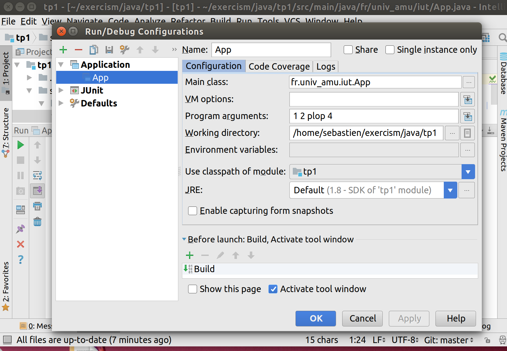
- Regardez bien les différents test pour bien comprendre les schémas.

#### Travail à faire :
- Écrire une classe `Args` qui permettra de manipuler facilement la ligne de commande. Dans un premier temps, 
inutile d'aller plus loin que le test `testSpacesInFormat`.

- Modifiez la classe `App` pour quelle utilise votre classe `Arg` pour gérer la ligne de commande suivant un schéma que 
vous aurez choisi. 

Comme pour l'exercice précédent, vous devez activer les tests les uns après les autres et soumettre votre solution après 
chaque itération du cycle principal du workflow.

