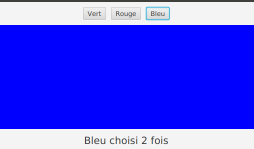
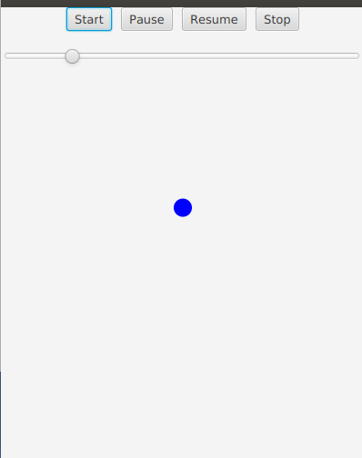

#  Introduction aux IHM en Java 

### IUT d’Aix-Marseille – Département Informatique Aix-en-Provence

* **Cours:** [M2105](http://cache.media.enseignementsup-recherche.gouv.fr/file/25/09/7/PPN_INFORMATIQUE_256097.pdf)
* **Responsable intérimaire:** [Cyril Pain-Barre](mailto:cyril.pain-barre@univ-amu.fr)
* **Responsable habituel:** [Sébastien NEDJAR](mailto:sebastien.nedjar@univ-amu.fr)
* **Enseignants actuels:** [Sophie Nabitz](mailto:sophie.nabitz@univ-avignon.fr), [Cyril Pain-Barre](mailto:cyril.pain-barre@univ-amu.fr)
* **Besoin d'aide ?**
    * La page [Piazza de ce cours](https://piazza.com/univ-amu.fr/spring2018/m2105/home).
    * Consulter et/ou créér des [issues](https://github.com/IUTInfoAix-M2105/tp2/issues).
    * [Email](mailto:sebastien.nedjar@univ-amu.fr) pour une question d'ordre privée, ou pour convenir d'un rendez-vous physique.

## TP 2 : Premiers pas avec JavaFX 11 [](https://travis-ci.com/IUTInfoAix-M2105/tp2)

**Avant propos :** à l'instar du TP précédent qui reposait essentiellement sur les fonctionnalités de java 8 bien que vous avez développé avec le JDK 11, ce TP repose lui aussi essentiellement sur JavaFX 8.0 alors que nous utiliserons la version JavaFX 11. Puisque depuis sa version 9, Java (et JavaFX) a été rendu modulaire, les explications qui suivent se basent sur JavaFX 11, sans en utiliser les nouveautés qui sortent du cadre de cet enseignement.

Dans sa version 8.0, JavaFX regroupait un ensemble d'API de Java 8 Standard Edition permettant le développement rapide d'applications graphiques modernes (aussi bien que des jeux 3D !).
JavaFX 8.0 était déjà tellement riche que sa 
documentation a été placée à part de celle de [Java 8](https://docs.oracle.com/javase/8/docs/api/index.html?overview-summary.html) (qui inclut celle de ses prédécesseurs AWT et Swing), bien qu'il fasse partie intégrante de Java 8.

Depuis sa version 11, JavaFX est devenu un composant additionnel du JDK, sous la forme d'un projet open-source qui n'est plus seulement développé par Oracle mais par toute une communauté. JavaFX dispose désormais de son propre [site de référence](https://openjfx.io/), à partir duquel on peut télécharger le SDK JavaFX et sur lequel on trouvera la [documentation de la version 11](https://openjfx.io/javadoc/11/) et des suivantes (la dernière version étant la 14). Vous devrez donc par la suite consulter la documentation de l'API de Java 11 ainsi que de JavaFX 11.

Ce TP est l'occasion d'un premier contact avec cet environnement.

#### Création de votre fork du TP

La première chose que vous allez faire est de créer un fork d'un dépôt. Pour ce faire, rendez-vous sur le lien suivant : 

[https://classroom.github.com/a/axCWCmgV](https://classroom.github.com/a/axCWCmgV) 

Comme pour le TP1, GitHub va vous créer un dépôt contenant un fork du dépôt 'IUTInfoAix-m2105/tp2' et s'appellant 'IUTInfoAix-m2105/tp2-votreUsername'. 
Vous apparaîtrez automatiquement comme contributeur de ce projet pour y pousser votre travail.

Une fois votre fork créé, il vous suffit de l'importer dans IntelliJ.


### Première application : les classes Application et Stage

Commençons par le plus simple programme permettant d'afficher une fenêtre JavaFX.

#### Exercice 1

Ouvrez le fichier `MyFirstJavaFXWindow.java` du paquet `exercice1` et exécutez-le. Une fenêtre devrait s'afficher avec 
le titre "*A Useless JavaFX Window*". Elle porte bien son nom car, en effet, cette fenêtre ne sert pas à grand chose...
Néanmoins, elle peut être minimisée, agrandie, déplacée, fermée etc. comme n'importe quelle fenêtre de votre bureau !

Le code de cette application graphique est le suivant :

```java
package fr.univ_amu.iut.exercice1;

import javafx.application.Application;
import javafx.stage.Stage;

public class MyFirstJavaFXWindow extends Application {

    @Override
    public void start(Stage primaryStage) throws Exception {
        primaryStage.setTitle("A Useless JavaFX Window");
        primaryStage.show();
    }

    public static void main(String[] args) {
        launch(args);
    }
}
```

Les deux premiers imports sont nécessaires pour utiliser les noms courts des deux classes indispensables à cet 
affichage : `javafx.application.Application` et `javafx.stage.Stage`.

Ainsi que la déclaration de notre classe `MyFirstJavaFXWindow` le montre avec l'emploi de `extends Application`, toute application JavaFX doit être une sous-classe de `Application`.

Dans un navigateur, ouvrez la documentation sur JavaFX 11, puis de la classe `Application` qui appartient au paquet `javafx.application` du module `javafx.graphics`. On observe que cette classe est **abstraite**, 
ce qui signifie que notre classe **concrète** `MyFirstJavaFXWindow` qui l'étend doit implémenter (redéfinir) toutes les méthodes 
abstraites de sa classe parente `Application`.

Dans la partie *Method Summary* (et l'onglet *Abstract Methods*) de la documentation, on remarque qu'`Application` ne possède qu'une seule méthode abstraite : la méthode `start()`.  C'est donc la seule méthode que notre classe doit forcément implémenter pour devenir concrète (et donc 
être instanciable).

Avant de s'intéresser à son contenu, observons que la classe `MyFirstJavaFXWindow` est une classe 
exécutable car elle définit la méthode `main()`. Celle-ci se contente d'appeler la méthode `launch()` en lui communiquant 
les arguments de la ligne de commande. `launch()` est une méthode **statique** de la classe `Application`. Son rôle est 
de créer une instance de notre `Application` et de la démarrer.

La méthode `start()` prend en paramètre une instance de la classe `Stage` qui est automatiquement créée par JavaFX dans `launch()`, 
et qui représente la fenêtre principale de notre application (qui pourra en créer d'autres si besoin).
Dans notre application, cette fenêtre est vide, alors qu'elle devrait être dotée d'une **scène** contenant des composants,
 comme nous le verrons plus loin ! Pour débuter, nous nous sommes contentés d'en définir le titre avec la méthode 
`setTitle()` puis de demander son affichage avec la méthode `show()`.

Ouvrez la documentation sur la classe `Stage`.
 
Remarquez que cette classe étend la classe `Window` qui est plus générale. `Window` définit les bases de toute fenêtre de 
premier niveau (*top level JavaFX container*), ce qui comprend aussi les *popups*. La classe `Stage` dispose de nombreuses méthodes (ou redéfinitions) 
qui lui sont propres et indiquées dans la partie *Method Summary* de sa documentation, ainsi que des méthodes héritées 
(et non redéfinies) de sa super-classe `Window` (et, par transitivité, de la super-classe `Object`) indiquées dans 
les parties *Methods inherited from ...*.

Pour valider cet exercice, supprimez ou mettez en commentaires l'annotation `@Disabled` dans la classe `TestMyFirstJavaFXWindow` et lancez les tests 
pour vérifier que tout est correct.

Ceci fait, penser à *commit*er vos modifications et de pousser votre dépôt sur GitHub.

### Cycle de vie d'une application

Étudions rapidement le cycle de vie d'une application JavaFX (figurant dans la 
documentation de la classe `Application`).

Pour rappel, la méthode statique `launch()` effectue dans l'ordre les opérations suivantes :
  1. crée une instance de notre sous-classe d'`Application`,

  2. appelle sa méthode `init()` qui, comme son nom l'indique, permet de procéder à d'éventuelles initialisations,

  3. appelle sa méthode `start()` en lui fournissant une instance de `Stage`,

  4. attend que l'application se termine, soit parce que l'application a appelé la méthode statique `Platform.exit()`, 
  soit parce que sa dernière fenêtre a été fermée et que l'attribut `implicitExit` de ``Platform`` est fixé à `true` (qui 
  est sa valeur par défaut),

  5. puis appelle sa méthode `stop()`.

Seule la méthode `start()` nécessite d'être implémentée car elle est abstraite. Les méthodes `init()` et `stop()` sont 
déjà définies (vides) dans la classe `Application`, mais peuvent être redéfinies dans notre sous-classe d'`Application` 
si besoin. 

Afin d'étudier le cycle de vie d'une application, vous allez tracer les différents appels en affichant des messages sur 
la *console*. Pour cela, vous utiliserez la méthode ``System.out.println()`` qui prend en paramètre un ``String`` 
contenant le message à afficher. Pour les entrées-sorties sur un terminal (ou console), la classe ``System`` 
fournit 3 données membres statiques ``in``, ``out`` et ``err`` qui représentent respectivement les flux de l'entrée 
standard, de la sortie standard et de la sortie d'erreur (comme le font les flux ``cin``, ``cout`` et ``cerr`` du C++).
Sans (trop) rentrer dans les détails, ``System.out`` est une instance de la classe ``java.io.PrintStream`` qui fournit 
de nombreuses méthodes d'écriture dans un flux parmi lesquelles plusieurs déclinaisons de la méthode ``println()`` dont 
celle prenant un ``String`` en paramètre.

#### Exercice 2

Allez dans le paquetage `exercice2` et ouvrir la classe `ApplicationLifeCycle`, puis :
* complétez le constructeur sans paramètre de cette classe, par l'affichage du message "*constructeur ApplicationLifeCycle()*" (pensez au raccourci `sout` d'IntelliJ)

* dans `start()` :
  - complétez la méthode en donnant le titre "*Application Life Cycle*" à la fenêtre
  
  - ajoutez l'affichage du message "*start() : avant show stage*"
  
  - faire appel à la méthode `show()` de `Stage` pour afficher la fenêtre
  
  - ajoutez l'affichage du message "*start() : après show stage*"

* redéfinissez la méthode `init()` de la classe `Application`, en se contenant d'afficher le message "*init()*"

* redéfinissez la méthode `stop()` de la classe `Application`, en se contenant d'afficher le message "*stop()*" 

* dans `main()`, ajoutez l'affichage des messages "*main() : avant launch*" et "*main() : après launch*", respectivement 
avant et après l'appel de `launch()`

Puis exécutez (et testez) cette classe, sans en fermer la fenêtre.

Remarquez que l'affichage s'arrête à celui **après** le `show()` qui a rendu visible la fenêtre. À ce stade, la 
méthode `start()` est déjà terminée. Java (FX) attend désormais que la fenêtre de l'application soit fermée.

Fermez la fenêtre et observez que la méthode `stop()` est alors appelée, ce qui met fin à notre application, 
puis que les instructions suivant le `launch()` de la méthode `main()` sont exécutées ensuite.

À nouveau, pour terminer l'exercice n'oubliez d'en activer tous les tests et de vous assurer qu'ils passent avec succès, vant de *commit*er vos modifications et de pousser votre dépôt sur GitHub. Ces étapes sont implicites dans la suite et ne seront plus rappelées.


### Qui fait quoi ?

Pour terminer l'étude du cycle de vie, intéressons-nous aux "organes" de Java qui animent (exécutent) notre application.
Pour réaliser certaines tâches, la JVM utilise des *threads*, qui sont des fils d'exécution distincts d'un même processus.
En général, un *processus* (ou l'un de ses threads) crée des threads pour réaliser des tâches annexes tout en continuant 
ses propres tâches. Bien que ce soit réducteur, retenons simplement que les threads s'exécutent en parallèle, peuvent se 
synchroniser, et partagent ensemble la mémoire du processus et ont donc accès aux mêmes objets de l'application.

#### Exercice 3

Ouvrez la classe ``WhoIsWho`` du paquet `exercice3`, puis :
1. ouvrez la documentation de la classe `Thread` (du paquet `java.lang` du module `java.base` de Java 11, et non pas de JavaFX), qui est la super classe des threads de la JVM, et recherchez-y :
    * la méthode **statique** qui renvoie le `Thread` courant,
    * la méthode d'**instance** qui renvoie un `String` contenant le nom de cet objet Thread (oui, ils ont un petit nom)

2. faites en sorte que toutes les méthodes (y compris le constructeur) aient un affichage identique à celui de l'exercice 2. 

3. préfixez ces affichages par la chaîne ``[``*nom*``]`` suivi d'un espace, où *nom* est le nom du 
thread courant (celui qui fait appel au ``println``).
  
Exécutez ensuite l'application pour constater que pas moins de 3 threads interviennent à différentes étapes du cycle de vie de cette si simple application.


### Quelques éléments de personnalisation d'une fenêtre
Maintenant que nous comprenons le cycle de vie d'une application JavaFX, nous allons pouvoir commencer à écrire un 
second programme graphique qui ne sera qu'une personnalisation de l'exercice 1.

#### Exercice 4
Pour commencer cet exercice, ouvrez la classe `MySecondJavaFxWindow` du paquetage `exercice4`, ainsi que la classe de test `TestMySecondJavaFxWindow`. 
Activer les tests les uns après les autres et ajouter au fur et à mesure le code nécessaire dans la méthode `start()` pour les faire passer (sans oublier de pousser votre solution après chaque itération du cycle principal du workflow) de manière à : 
* le titre de la fenêtre soit "*Second Useless JavaFX Window*"
* qu'elle soit toujours placée au premier plan et ne pas être redimensionnable (cherchez dans la documentation de ``Stage`` parmi les méthodes qui commencent par **`set`**),
* qu'elle ait une largeur fixée à 800 pixels et une hauteur fixée à 400 pixels (cherchez dans les méthodes héritées de ``Window`` commençant par `set`).

Terminez par l'ajout d'un appel à la méthode `show()` pour afficher la fenêtre.

Exécutez l'application pour vérifier les conséquences de vos modifications. 


##### Remarque
La taille de la fenêtre se définit rarement directement comme dans cet exercice. En général, on la laisse s'adapter à la 
**scène** qu'elle contient. Elle-même pourra avoir une taille fixée, ou calculée en fonction de son contenu. 

#### Exercice 5

Modifiez le code de l'application qui vous est donné de manière à changer le style de la fenêtre pour qu'elle ne soit 
pas décorée (recherchez parmi les méthodes relatives à du style). Ajoutez les propriétés que les tests vous imposent pour être totalement validées.

Puisqu'elle n'est plus décorée, la fenêtre qui s'affiche ne dispose plus du bouton permettant de terminer l'application !
Néanmoins, sur un bureau comme le vôtre qui dispose d'une barre de tâches, un simple clic droit sur l'icône 
correspondante nous donne accès à un menu contextuel permettant de la fermer. Un autre moyen est de cliquer sur le carré 
rouge de la partie *Run:* en bas à gauche de la fenêtre IntelliJ, aussi présent en haut à droite.


### Premières applications graphiques : composants et événements
Pour placer des composants dans une fenêtre, nous utiliserons principalement le conteneur `BorderPane`.
Ce conteneur permet de placer des composants enfants dans cinq zones : `Top`, `Bottom`, `Left`, `Right` et `Center`.

Un seul objet `Node` (composant, conteneur, …) peut être placé dans chacun de ces emplacements. Le conteneur `BorderPane` 
est fréquemment utilisé comme conteneur racine du graphe de scène car il correspond à une division assez classique de la 
fenêtre principale d'une application (barre de titre, barre d'état, zone d'options, zone principale, etc.).

Le `BorderPane` est l'un des nombreux gestionnaires de disposition de composants disponibles dans Java FX. Ces gestionnaires seront étudiés plus en détail lors du prochain TP.
 

#### Exercice 6

Ouvrez la classe `HelloLabel` et modifiez la méthode `start()` pour que votre application affiche une fenêtre 
respectant les contraintes suivantes : 

- Le titre de la fenêtre principale doit être "Hello !"

- Le `Stage` doit contenir une `Scene` de largeur 250 et de hauteur 100

- Le graphe de cette scène doit avoir pour racine un nœud du type `BorderPane`

- Au centre de ce `BorderPane`, placez un `Label` (voir la documentation de cette classe) ayant pour `text` la chaîne `Hello !`

- Ce label doit avoir pour `Id` la valeur `"labelHello"` (attention, sans `#`) ; ici encore, vous pouvez utiliser un setter

- La fenêtre doit être visible

Exécutez l'application pour vérifier le fonctionnement de cette fenêtre. Redimensionnez-là pour voir comment se comporte 
votre `Label`. Comme pour l'exercice précédent, vous devez activer les tests les uns après les autres et soumettre votre 
solution après chaque itération du cycle principal du workflow.

#### Exercice 7
Les labels sont des composants pour afficher un texte. Ils sont souvent utilisés conjointement avec des composants comme 
les `TextField` (ou tout autre composant de saisie). Maintenant que nous avons vu ce composant passif, nous allons voir 
le premier avec lequel nous pouvons interagir : le `Button`.

Ouvrez la classe `HelloButton` et modifiez la méthode `start()` pour que votre application affiche une fenêtre 
respectant les mêmes contraintes qu'à l'exercice 6, mais à la place d'un `Label`, vous utiliserez un `Button` (voir la 
documentation de cette classe) ayant pour `text` la chaîne `Hello !` et pour `Id` la valeur `"buttonHello"`.

Exécutez l'application pour vérifier le fonctionnement de cette fenêtre. Comme pour l'exercice précédent, vous devez 
activer les tests les uns après les autres et soumettre votre solution après chaque itération du cycle principal du workflow.

#### Exercice 8

Pour l'instant notre bouton paraît bien triste. Ajoutons-lui quelques décorations pour qu'il soit plus esthétique.

Ouvrez la classe `HelloBeautifulButton` et modifiez la méthode `start()` pour que votre application affiche une fenêtre 
respectant les contraintes suivantes :

- Respecter toutes les contraintes de l'exercice précédent

- Construire un objet du type `ImageView` ouvrant l'image située à l'URL suivante : https://raw.githubusercontent.com/IUTInfoAix-M2105/Syllabus/master/assets/logo.png

- Positionner cet objet comme valeur de la propriété `Graphic` de notre bouton.

- Ajouter une feuille de style CSS pour améliorer l'apparence de votre application. Pour ce faire, ajouter la ligne suivante juste après la création de l'objet `Scene` :
```java
        scene.getStylesheets().add(getClass().getClassLoader().getResource("DarkTheme.css").toExternalForm());
```

- Agrandir la hauteur de la scène à 250

- Rendre visible la fenêtre

Exécutez l'application pour vérifier le fonctionnement de cette fenêtre. Comme pour l'exercice précédent, vous devez 
activer les tests les uns après les autres et soumettre votre solution après chaque itération du cycle principal du workflow.

#### Exercice 9

Bien que le bouton soit un peu plus attrayant, il n'est pour l'instant pas très interactif. Généralement, l'utilisateur 
s'attend à ce qu'un bouton lance un traitement lorsqu'on l'actionne. Pour ce faire, Java permet de réagir aux événements 
avec le mécanisme des écouteurs (`Listener`). Dans les exercices qui suivent, nous allons voir plusieurs solutions pour 
implémenter ce mécanisme.

D'un point de vue purement technique, un `Listener` est un objet qui implémente l'interface 
[`EventHandler<T extends Event>`](https://openjfx.io/javadoc/11/javafx.base/javafx/event/EventHandler.html). Cette 
interface possède une unique méthode appelée `handle()` qui sera appelée lorsqu'un événement se produit.

Pour qu'un *écouteur* soit appelé au bon moment (lorsqu'un événement est déclenché par une action extérieure), il faut 
qu'il s'enregistre auprès de l'objet qu'il souhaite écouter. Pour la classe `Button`, c'est la méthode `setOnAction()` 
qui permet à un écouteur de s'enregistrer pour être informé quand le bouton est actionné.

Ouvrez donc les classes `HelloBeautifulUsefulButton` et `EcouteurSimple`, puis implémentez-les en respectant les 
contraintes suivantes :

- La classe `EcouteurSimple` doit implémenter l'interface `EventHandler<ActionEvent>`

- La méthode `handle()` de cette classe se contente d'afficher le texte "Bouton actionné" sur la sortie standard.

- La classe `HelloBeautifulUsefulButton` doit respecter les même contraintes que `HelloBeautifulButton`.

- Le bouton doit ajouter une instance de la classe `EcouteurSimple` comme écouteur

- Rendre visible la fenêtre

Exécutez l'application pour vérifier le fonctionnement de cette fenêtre. Comme pour l'exercice précédent, vous devez 
activer les tests les uns après les autres et soumettre votre solution après chaque itération du cycle principal du workflow.

#### Exercice 10
Créer une classe spécialement pour être utilisée une seule fois, comme vous l'avez fait pour `EcouteurSimple`, peut être 
considéré comme fastidieux. En plus, il y a des cas où l'écouteur peut nécessiter d'accéder à des données locales et/ou 
des données membres privées. L'une des solutions dans ce cas est d'utiliser une classe anonyme.

Une classe anonyme est un mécanisme du langage Java qui permet de **déclarer une classe** et de **créer un objet (instance)**
de celle-ci en une seule et même expression. La classe anonyme est un sous-type d'une interface ou d'une classe abstraite 
ou concrète.

**Syntaxe :**
```java
Type var = new Type(param1,param2...) {
 //(re)définition de membres
 //(méthode/champs/classe)
};
```

Dans le cas d'un écouteur simple utilisé pour un seul composant, on pourrait le créer comme suit: 
```java
EventHandler<ActionEvent> ecouteur = new EventHandler<ActionEvent>() {
    @Override
    public void handle(ActionEvent event) {
        //Code de l'écouteur d'événement
    }
};
```

Ouvrez donc la classe `HelloBeautifulUsefulButton` (du paquetage `exercice10`) et implémentez-la en respectant les 
contraintes suivantes :

- L'écouteur d'événement du bouton devra être une classe anonyme qui implémente `EventHandler<ActionEvent>`

- La méthode `handle()` de cette classe affiche le texte "Bouton actionné x fois" sur la sortie standard. 
La valeur *x* doit correspondre au nombre de fois que le bouton a été actionné.

- L'objet créé ainsi doit être enregistré comme écouteur du bouton

- La classe `HelloBeautifulUsefulButton` doit respecter les mêmes contraintes que `HelloBeautifulButton`

- Rendre visible la fenêtre

Exécutez l'application pour vérifier le fonctionnement de cette fenêtre. Comme pour l'exercice précédent, vous devez 
activer les tests les uns après les autres et soumettre votre solution après chaque itération du cycle principal du workflow.

#### Exercice 11
Avec les classes anonymes, l'écriture des écouteurs est grandement facilitée. Malgré tout, le code associé n'est pas très 
lisible et assez verbeux. Depuis Java 8, il est possible de rendre ce code encore plus explicite grâce à un nouveau 
concept, les expressions lambda.

Les expressions lambda sont parmi les nouveaux concepts introduits dans Java 8. Elles ont connu un développement 
considérable pour ses rapports étroits avec les langages de programmation fonctionnelle. Son intérêt principal provient 
de la simplicité de sa syntaxe.

Les lambda sont une syntaxe particulière qui permet de remplacer les classes anonymes dans certains cas : celui de 
l'implémentation des interfaces fonctionnelles.

Dit simplement, **une interface fonctionnelle** n’est rien d’autre qu’une interface avec **une seule méthode abstraite**. 
Et c’est ce qui permet d’implémenter facilement les expressions lambda. Avec l'annotation `@FunctionalInterface`, on 
demande au compilateur de vérifier que l’interface possède bien une seule méthode abstraite. C’est le même principe 
que l'annotation `@Override`, vue précédemment dans l’implémentation de nos différentes opérations. La seule condition 
pour que l’affectation d’une expression lambda à une variable (d’une interface fonctionnelle) soit possible est que, 
la signature de la méthode abstraite de l’interface fonctionnelle doit correspondre à ("matcher") celle de l’expression 
lambda. Pour simplifier la compréhension, on peut imaginer que l’expression lambda est une implémentation de l’interface 
fonctionnelle.

Une expression lambda comprend trois parties :

- son(ses) paramètre(s), entre parenthèses et séparés par une virgule quand il y en a plusieurs

- l'opérateur `->`

- son corps (le code exécuté).

Par exemple dans le cas de l'interface fonctionnelle `EventHandler<T>`, on pourrait écrire la lambda suivante pour faire 
le même traitement que celui attendu à l'exercice 9 :
```java
EventHandler<ActionEvent> ecouteur = event -> System.out.println("Bouton actionné");
```
Cette expression lambda se décompose comme suit : 
- `event` est le seul paramètre de l'expression. Il n'est donc pas nécessaire de l'encadrer de parenthèses. Il correspond 
au paramètre de la méthode de l'interface fonctionnelle associée. Dans notre cas, `event` sera donc du type `ActionEvent`.

- l'opérateur `->` qui est l'élément syntaxique qui identifie une lambda

- `System.out.println("Bouton actionné")` est le code qui sera exécuté lors de l'appel de la lambda. Dans cet exemple,
 c'est le code exécuté pour gérer un événement `ActionEvent`. Dans le cas où le corps comporte plusieurs instructions, il faut les
 encadrer d'accolades (bloc d'instructions).


Ouvrez la classe `HelloBeautifulUsefulButton` et implémentez-la en respectant les contraintes suivantes :

- La classe `HelloBeautifulUsefulButton` doit respecter les mêmes contraintes que `HelloBeautifulUsefulButton` du paquetage `exercice10`.

- L'écouteur d'événement devra être écrit en utilisant le mécanisme des expressions lambda.

Exécutez l'application pour vérifier le fonctionnement de cette fenêtre. Comme pour l'exercice précédent, vous devez 
activer les tests les uns après les autres et soumettre votre solution après chaque itération du cycle principal du workflow.


### Sujets complémentaires : Animations, gestionnaires de positionnement et dessin

#### Exercice 12 : La palette de couleurs
Dans cet exercice, on va commencer à assembler les différentes connaissances acquises jusqu'à présent.
L'objectif sera de réaliser une fenêtre dont la partie centrale changera de couleur en fonction des actions sur des 
boutons situés dans la partie supérieure de la fenêtre. La partie basse permettra d'indiquer le nombre de fois où la 
couleur actuellement affichée aura été utilisée.

Votre fenêtre principale devrait ressembler à cela à la fin de l'exercice :



La racine de notre graphe de scène sera un objet de la classe `BorderPane`.  

Pour placer plusieurs composants dans les zones du `BorderPane`, il faut y ajouter des nœuds de type conteneur et ajouter 
ensuite les composants dans ces conteneurs imbriqués. Dans cet exercice, les conteneurs que nous utiliserons en haut et en bas du `BorderPane` sont des `HBox` (un autre gestionnaire de disposition qui place ses composants les uns à la suite des autres horizontalement).

Pour changer la couleur du panneau central, on utilisera le fait que chaque composant JavaFx peut être personnalisé 
facilement en utilisant des styles CSS. Au lieu d'utiliser une feuille de style complète, on se contentera d'injecter 
le style adapté directement dans le panneau avec l'utilisation de la méthode `setStyle()`.

Voici un exemple de changement de couleur de fond similaire à celui que vous devrez faire dans les écouteurs de vos boutons :

```java
Pane panneau = new Pane();
panneau.setStyle("-fx-background-color: white");
```

Dans le Paquetage `exercice12`, ouvrir la classe `Palette` et l'implémenter en respectant les consignes suivantes :

- La classe devra posséder les données membres suivantes : 

    - un conteneur racine de type `BorderPane`.
    
    - un panneau vide de type `Pane` qui servira de panneau central changeant de couleur en fonction des actions de 
    l'utilisateur.
    
    - un panneau de type `HBox` pour la barre de boutons.
     
    - un autre panneau de type `HBox` pour la barre d'état affichant le nombre d'apparition de la couleur courante.

    - un libellé de type `Label` qui servira à afficher le nombre de fois ou la couleur courante a été choisie. 

    - trois `Button` qui permettront de choisir la couleur du panel central.
    
    - en plus de ces différents noeuds, il faudra aussi 3 entiers pour conserver le nombre d'apparition de chaque couleur.

- Pour vous simplifier la vie, vous pouvez instancier toutes les données membres lors de leur déclaration.

- Le panneau central doit avoir une taille préférée de 400 par 200 (regardez dans la documentation de la classe `Pane` 
pour connaitre la méthode à utiliser).

- Les deux `HBox` doivent être alignées au centre (regardez dans la documentation de la classe `HBox`)

- Chaque bouton aura un écouteur d'événement associé qui changera la couleur de fond du panneau central, modifiera le 
nombre d'apparition de la couleur courante et affichera le texte correspondant dans le panel du bas.

- Les différents composants devront être ajoutés à leur panneau de destination.
 
- Les 3 panneaux seront ajoutés au conteneur racine.

##### Remarque
Vous n'obtiendrez pas exactement le même rendu que l'image de la fenêtre du sujet, car elle est un peu plus personnalisée. Une fois l'exercice réalisé et testé, vous pouvez améliorer le rendu avec les éléments suivants :

- entre les boutons du haut, il y a un espace de 10 pixels qui peut être précisé lors de la création du `HBox` correspondant

- les deux `HBox` sont dotés d'un remplissage (*padding*) de 10 pixels en haut et en bas (et de 5 pixels à droite et à gauche mais ce n'est pas apparent). Trouvez dans la documentation de `HBox` la méthode qui fixe ce padding, ainsi que l'objet à utiliser pour le représenter.

- le texte du bas utilise la police *Tahoma*, de poids (graisse) normal, et de taille 20. Cherchez dans la documentation de `Label` comment préciser la police qui, elle, est obtenue grâce à une méthode statique de la classe `javafx.scene.text.Font` à laquelle on fournit les caractéristiques souhaitées.

#### Variante Exercice 12

Dans cette variante, on vous demande de réaliser la même application (dans un fichier à part du même paquetage) mais de n'utiliser qu'un seul écouteur qui devra examiner la source de l'événement afin d'en déduire le bouton actionné.


#### Exercice 13 : Balle rebondissante
Pour continuer notre tour de JavaFX, nous allons regarder rapidement les possibilités d'animation des IHM avec JavaFX. 
Une animation est, comme son nom l'indique, un mécanisme qui permet d'animer un objet : le faire se déplacer, le faire 
tourner, le faire disparaître, le faire grandir, etc... On peut imaginer tout un tas d'animations possibles. Nous allons 
voir que pour faire une animation, on utilise les propriétés. Ça sera l'occasion de voir que le principe des écouteurs 
d'événements fonctionne aussi pour être informé des changements de valeur d'une propriété.

Dans cet exercice, notre objectif va être de simuler une balle rebondissante parfaite (elle rebondira perpétuellement).
  
Notre application finale devra ressembler à cela :



La barre de boutons permettra de lancer, mettre en pause, redémarrer et arrêter l'animation. En dessous, un `slider` 
permettra de régler le facteur de vitesse de rebondissement de la balle. Le dernier panneau contiendra l'animation de 
la balle.

Pour dessiner la balle, on utilisera un objet du type `Circle`.

L'animation que l'on utilisera sera une simple translation de bas en haut. Pour ce faire nous utiliserons la 
classe `TranslateTransition`. Cette classe permet de définir l'animation d'un objet en faisant une translation 
pendant une durée donnée à la construction.

La balle faisant un mouvement vertical de haut en bas, pour définir notre animation, il faudra simplement donner une 
ordonnée de départ et d'arrivée avec les méthodes `setFromY()` et `setToY()`.
 
Pour que notre balle remonte indéfiniment, il faudra modifier les valeurs des propriétés `autoreverse` et `cycleCount`.

Une fois l'animation créée et correctement configurée, il suffit d'utiliser les méthodes `playFromStart()`, `pause()`, 
`play()` et `stop()` pour la contrôler.

On utilisera aussi la propriété `Rate` pour accélérer et ralentir la balle avec le slider.

Comme expliqué dans le cours, le mécanisme des propriétés permet d'être informé d'un changement de valeur d'une variable d'instance. Ce mécanisme se base sur les écouteurs (exactement comme les boutons). Dans notre cas, nous souhaitons changer 
le `Rate` à chaque changement de la propriété `value` du slider. Cela pourrait se faire de la manière suivante :
```java
slider.valueProperty().addListener(
        (observable, oldValue, newValue) -> transition.setRate(newValue.doubleValue())
        );
```

Dans le Paquetage `exercice13`, ouvrez la classe `BouncingBall` et implémentez-la en respectant les consignes suivantes :

- La classe devra posséder les données membres suivantes : 
    - un conteneur racine de type `VBox`
    
    - un panneau vide de type `Pane` qui servira de zone d'animation
    
    - un panneau de type `HBox` pour la barre de boutons
    
    - quatre `Button` qui permettront de contrôler l'animation
    
    - un slider pour contrôler la vitesse
    
    - un cercle pour représenter la balle
    
    - Un objet du type `TranslateTransition`
- Pour vous simplifier la vie, vous pouvez instancier toutes les données membres lors de leur déclaration.

- Configurez votre animation pour que votre balle démarre à l'ordonnée 10 et termine à 400. Par défaut réglez la durée à *1s* (soit *1000 milli-secondes*).

- Ajoutez les boutons à la `HBox`.

- Chaque bouton aura un écouteur d'événement associé qui appellera la méthode de contrôle de l'animation correspondant à son nom.

- Réglez le slider pour qu'il prenne des valeurs allant de 0,1 à 5.

- Ajoutez un écouteur sur la propriété `value` pour que la vitesse de votre animation varie en fonction de la position du curseur du slider.

- Ajoutez la balle dans le `Pane`.

- Ajoutez la `HBox`, le `Slider` et le `Pane` comme enfants du conteneur principal.
