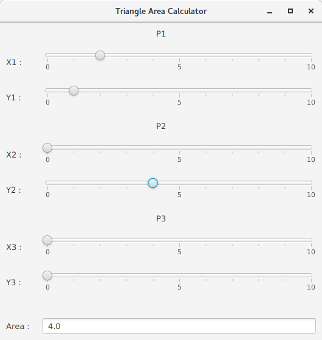
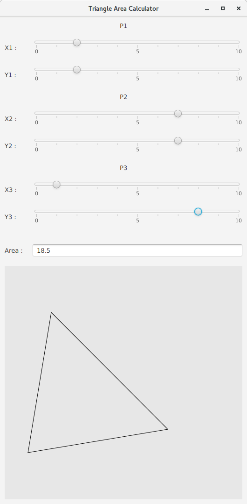
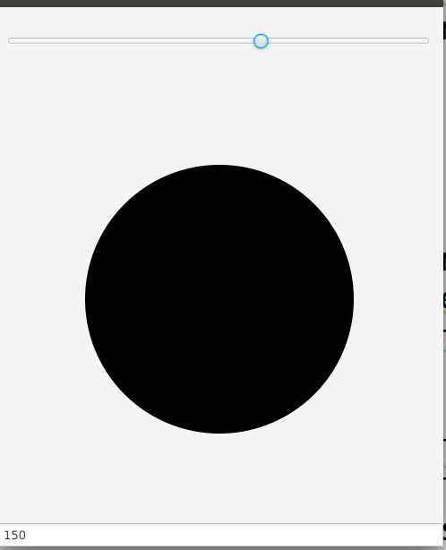
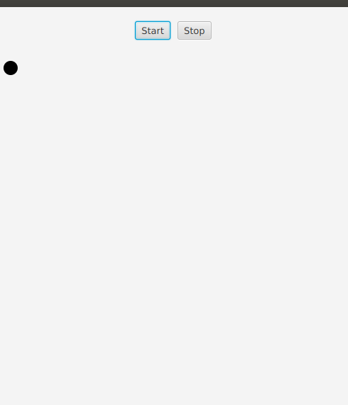
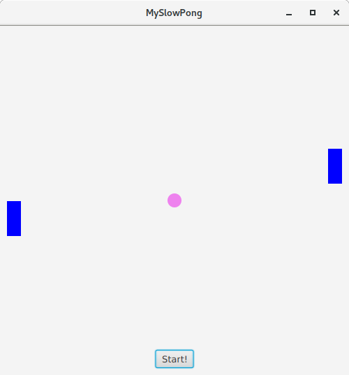

#  Introduction aux IHM en Java 

### IUT d’Aix-Marseille – Département Informatique Aix-en-Provence

* **Cours:** [M2105](http://cache.media.enseignementsup-recherche.gouv.fr/file/25/09/7/PPN_INFORMATIQUE_256097.pdf)
* **Responsable intérimaire:** [Cyril Pain-Barre](mailto:cyril.pain-barre@univ-amu.fr)
* **Responsable habituel:** [Sébastien NEDJAR](mailto:sebastien.nedjar@univ-amu.fr)
* **Enseignants actuels:** [Sophie Nabitz](mailto:sophie.nabitz@univ-avignon.fr), [Cyril Pain-Barre](mailto:cyril.pain-barre@univ-amu.fr)
* **Besoin d'aide ?**
    * La page [Piazza de ce cours](https://piazza.com/univ-amu.fr/spring2018/m2105/home).
    * Consulter et/ou créér des [issues](https://github.com/IUTInfoAix-M2105/tp1/issues).
    * [Email](mailto:cyril.pain-barre@univ-amu.fr) pour une question d'ordre privée, ou pour convenir d'un rendez-vous physique.

## TP 3 :  Propriétés et Bindings [](https://travis-ci.com/IUTInfoAix-M2105/tp3)

JavaFX 11 regroupe un ensemble d'API permettant le développement rapide d'applications 
graphiques modernes (aussi bien que des jeux 3D !). La [documentation](https://openjfx.io/javadoc/11/) de JavaFX 11 se trouve à part de celle de 
[Java 11](https://docs.oracle.com/en/java/javase/11/docs/api/index.html) (qui inclut celle de ses prédécesseurs AWT et Swing).

Ce TP explore les mécanismes clefs de JavaFX : Les propriétés, les bindings.

#### Création de votre fork du TP

La première chose que vous allez faire est de créer un fork d'un dépôt. Pour ce faire, rendez-vous sur le lien suivant : 

[https://classroom.github.com/a/hh3u00mM](https://classroom.github.com/a/hh3u00mM) 

Comme pour les précédents TP, GitHub va vous créer un dépôt contenant un fork du dépôt 'IUTInfoAix-m2105/tp3' et s'appellant 'IUTInfoAix-m2105/tp3-votreUsername'. 
Vous apparaîtrez automatiquement comme contributeur de ce projet pour y pousser votre travail.

Une fois votre fork créé, il vous suffit de l'importer dans IntelliJ.


### Première étape : découvertes des propriétés et des bindings

#### Exercice 1

En Java, une propriété est un élément d'une classe que l'on peut manipuler à l'aide de getters (lecture) et 
de setters (écriture). Les propriétés sont généralement représentées par des attributs de la classe mais elles pourraient 
aussi être stockées dans une base de données ou autre système d'information.

Classiquement la convention dite *"JavaBeans"*, définit qu'une classe possédant une propriété nommée `XXX` doit avoir une 
méthode `getXXX()` et `setXXX()`. En plus de ces méthodes, les propriétés JavaFX possèdent une troisième méthode 
`XXXProperty()` qui retourne un objet qui implémente l'interface `Property`.

Intérêt des propriétés :

- Elles peuvent déclencher un événement lorsque leur valeur est modifiée et un gestionnaire d'événement (`Listener`) peut réagir en conséquence.

- Elles peuvent être liées entre-elles (Binding), c'est-à-dire que le changement d'une propriété entraîne automatiquement la mise à jour d'une autre.

Pour simplifier la vie du développeur, la plateforme Java offre des classes permettant de créer de telles propriétés 
facilement pour les types les plus courants (des types primitifs, les chaînes de caractères, certaines collections ainsi 
que le type `Object` qui peut couvrir tous les autres types) :

- `IntegerProperty` / `SimpleIntegerProperty`

- `DoubleProperty` / `SimpleDoubleProperty`

- ...
    
- `StringProperty` / `SimpleStringProperty`
    
- `ListProperty<E>` / `SimpleListProperty<E>`
    
- `ObjectProperty<T>` / `SimpleObjectProperty<T>`
    
    
Par exemple, la classe abstraite `IntegerProperty` permet d'emballer une valeur de type entier et d'offrir des méthodes 
pour consulter et modifier la valeur mais également pour *"observer"* et *"lier"* les changements. La classe 
`SimpleIntegerProperty` quant à elle est une classe concrète prédéfinie permettant de créer une telle propriété.

Toutes les classes de propriétés implémentent l'interface `Observable` et offrent de ce fait, la possibilité 
d'enregistrer des observateurs (`Listener`) qui seront avertis lorsque la valeur de la propriété change.

Une instance de l'interface fonctionnelle `ChangeListener<T>` pourra ainsi être créée pour réagir à un tel changement. 
La méthode `changed()` sera alors invoquée et recevra en paramètre la valeur observée ainsi que l'ancienne et la nouvelle 
valeur de la propriété.

L'interface fonctionnelle `InvalidationListener<T>` permet également de réagir aux changements des valeurs de propriétés 
dans les situations où les propriétés sont calculées à partir d'autres et que l'on veut éviter d'effectuer les calculs 
à chaque changement. Avec cette interface, c'est la méthode `invalidated(Observable o)` qui est invoquée lorsqu'un 
changement potentiel de la valeur de la propriété est intervenu.

Les composants utilisés dans les interfaces graphiques (boutons, champs texte, cases à cocher, sliders, etc.) possèdent 
tous de nombreuses propriétés. Pour chacun des composants, la documentation (*Javadoc*) décrit dans une des 
rubriques (*Property Summary*) la liste des propriétés de la classe concernée ainsi que celles qui sont héritées.

Cet exercice permet d'illustrer le rôle de ces deux types d'écouteurs.
Allez dans le(s) paquetage(s) `exercice1` (main et test) et ouvrir les classes `PropertyExample` et `PropertyExampleTest`.

Comme pour les exercices précédents, vous devez activer les tests les uns après les autres et soumettre votre 
solution après chaque itération du cycle principal du workflow.

Au final, dans `PropertyExample` :

- Écrivez la méthode `createProperty()` qui va initialiser la variable d'instance `anIntProperty` avec un `SimpleIntegerProperty`, et afficher une ligne vide puis l'objet créé ainsi 
que sa valeur, qui aura été fixée à 1024. Se référer au test pour savoir quel affichage est précisément attendu.

- Écrivez avec une expression *lambda*, l'initialisation de la variable d'instance `changeListener` qui est un écouteur de 
changement de valeur. Cet écouteur se contente d'afficher le texte `"The observableValue has changed:"` suivi de l'ancienne et de la nouvelle valeur de l'objet 
observé.

- Écrivez avec une autre expression *lambda*, l'initialisation de la variable d'instance `invalidationListener` qui est un écouteur d'invalidation de la valeur 
d'une propriété. Cet écouteur se contente d'afficher le texte `"The observable has been invalidated."` pour indiquer qu'un événement d'invalidation 
s'est déclenché **sans pour autant afficher la valeur de l'objet observé**.

- Écrivez la méthode `addAndRemoveInvalidationListener()` dont les affichages serviront à comprendre le rôle d'un `InvalidationListener`.
 Cette méthode doit effectuer les actions suivantes :
    - Afficher sur la console une ligne vide
    - Afficher sur la console le texte `"Add invalidation listener."` puis ajouter l'objet `invalidationListener` comme écouteur de la propriété `anIntProperty`
    - Afficher le texte `"setValue() with 1024."` puis modifier la valeur de la propriété avec la méthode `setValue()` pour la fixer à 1024 (la même valeur qu'initialement afin d'observer le comportement de la propriété)
    - Afficher le texte `"set() with 2105."` puis modifier à nouveau la valeur de la propriété avec la méthode `set()` pour la fixer à 2105
    - Afficher le texte `"setValue() with 5012."` puis modifier à nouveau la valeur de la propriété avec la méthode `setValue()` pour la fixer à 5012
    - Afficher le texte `"Remove invalidation listener."` puis supprimer l'écouteur de la propriété 
    - Afficher le texte `"set() with 1024."` puis modifier une dernière fois la valeur de la propriété avec la méthode `set()` pour la remettre à 1024

- Écrire la méthode `addAndRemoveChangeListener()` dont les affichages serviront à comprendre le rôle d'un `ChangeListener`. 
Cette méthode doit effectuer les actions suivantes :
    - Afficher sur la console une ligne vide
    - Afficher sur la console le texte `"Add change listener."` puis ajouter l'objet `changeListener` comme écouteur de la propriété `anIntProperty`
    - Afficher le texte `"setValue() with 1024."` puis modifier la valeur de la propriété avec la méthode `setValue()` pour la fixer à 1024 (la même valeur qu'elle possède déjà afin d'observer le comportement de la propriété)
    - Afficher le texte `"set() with 2105."` puis modifier à nouveau la valeur de la propriété avec la méthode `set()` pour la fixer à 2105
    - Afficher le texte `"setValue() with 5012."` puis modifier à nouveau la valeur de la propriété avec la méthode `setValue()` pour la fixer à 5012
    - Afficher le texte `"Remove change listener."` puis supprimer l'écouteur de la propriété 
    - Afficher le texte `"set() with 1024."` puis modifier une dernière fois la valeur de la propriété avec la méthode `set()` pour la remettre à 1024
  

Vous devriez remarquer que le premier `setValue()` est sans effet dans les deux cas, car la propriété est suffisamment intelligente pour s'apercevoir qu'il ne modifie pas sa valeur.
Vous devriez aussi remarquer que l'`InvalidationListener` n'est averti que lors du premier changement effectif de valeur, à la différence du `ChangeListener` qui est systématiquement averti lorsque la valeur change. 
En effet, après un changement, une propriété demeure invalide tant qu'on ne demande pas sa valeur avec `get()` ou `getValue()`.

Pour le constater, vous pouvez ignorer les tests et ajouter l'affichage de la valeur dans l'expression lambda de l'écouteur `invalidationListener`.
Dans ce cas, tout changement de valeur avertira l'`InvalidationListener` puisque ce dernier valide maintenant à chaque fois la valeur lors du `get()`.

#### Exercice 2
Un des avantages des propriétés JavaFX est la possibilité de pouvoir les lier entre-elles. Ce mécanisme, appelé 
**binding**, permet de mettre à jour automatiquement une propriété en fonction d'une autre.

Dans les interfaces utilisateurs, on a fréquemment ce type de liens. Par exemple, lorsqu'on déplace le curseur d'un 
slider, la valeur d'un champ texte changera (ou la luminosité d'une image, la taille d'un graphique, le niveau sonore, etc.).

Il est possible de lier deux propriétés **A** et **B** de manière :
- *Unidirectionnelle* : un changement de **A** entraînera un changement de **B** mais pas l'inverse (**B** ne devant pas être modifié autrement).

- *Bidirectionnelle* : un changement de **A** entraînera un changement de **B** et réciproquement (les deux sont modifiables).
    
La méthode `bind()` permet de créer un lien unidirectionnel. La méthode doit être appelée sur la propriété qui sera 
*"soumise"* à l'autre (celle qui est passée en paramètre). Une propriété ne peut être liée (asservie) qu'à une seule 
autre si le lien est unidirectionnel (`bind()`). Si l'on tente de modifier la valeur de la propriété associée d'une 
autre manière, une exception sera levée. 

Allez dans le paquetage `exercice2` et ouvrir la classe `PropertyExampleContinued`, puis l'implémenter en respectant les 
consignes suivantes (se référer aux tests pour les détails d'affichage) :

- Écrire la méthode `bindAndUnbindOnePropertyToAnother()`. Cette méthode doit effectuer les actions suivantes :
   - Déclarer une variable `otherProperty` du type `IntegerProperty` (classe abstraite) et lui affecter une instance de la classe concrète `SimpleIntegerProperty` contenant 0 comme valeur initiale.
   
   - Afficher la valeur de `otherProperty`
   
   - Soumettre (lier unidirectionnellement) la valeur de `otherProperty` à celle de `anIntProperty`.
   
   - Afficher la valeur de `otherProperty`
   
   - Modifier la valeur de la propriété `anIntProperty` avec la valeur 7168
   
   - Afficher la valeur de `otherProperty`
   
   - Délier les deux propriétés
   
   - Afficher la valeur de `otherProperty`
   
   - Modifier la valeur de la propriété `anIntProperty` avec la valeur 8192
   
   - Afficher la valeur de `otherProperty`
   
  Chaque action sera tracée avec des affichages pour bien comprendre ce qui se passe.
  
Comme pour les exercices précédents, vous devez activer les tests les uns après les autres et soumettre votre 
solution après chaque itération du cycle principal du workflow. Une fois vos tests validés, prenez du temps pour 
observer le comportement de la fonction `bindAndUnbindOnePropertyToAnother()` à travers l'affichage sur la console.

#### Exercice 3
Parfois, une propriété dépend d'une autre mais avec une relation plus complexe. Il est ainsi possible de créer des 
**propriétés calculées**.

Deux techniques (dites de *"haut-niveau"*) sont à disposition (elles peuvent être combinées) :

   - Utiliser la classe utilitaire `Bindings` qui possède de nombreuses méthodes statiques permettant d'effectuer des 
   opérations impliquant un ou plusieurs objets observables (dont les propriétés). Par exemple, `Bindings.multiply(unePropriete, autrePropriete)`.

   - Utiliser les méthodes disponibles dans les classes qui représentent les propriétés; ces méthodes peuvent être 
   chaînées (Fluent API). Par exemple, `unePropriete.multiply(autrePropriete)`.

Des opérations de conversions sont parfois nécessaires si le type des propriétés à lier n'est pas le même. Par exemple 
pour lier un champ texte (`StringProperty`) à un slider dont la valeur est numérique (`DoubleProperty`). 

Un jeu d'opérations est disponible aussi bien avec la classe `Bindings` qu'avec les méthodes chaînables :
- `min()`, `max()`

- `equal()`, `notEqual()`, `lessThan()`, `lessThanOrEqual()`, …

- `isNull()`, `isNotNull()`, `isEmpty()`, `isNotEmpty()`, …

- `convert()`, `concat()`, `format()`, …

- `valueAt()`, `size()`, …

- `when(cond).then(val1).otherwise(val2)` 

- et beaucoup d'autres que l'on peut découvrir en parcourant la JavaDoc de la classe 
[`Bindings`](https://openjfx.io/javadoc/11/javafx.base/javafx/beans/binding/Bindings.html).

Cet exercice illustre l'utilisation de multiples binding de haut niveau afin de mettre à jour automatiquement la valeur 
de l'aire d'un triangle à partir des coordonnées de ses 3 sommets. 
Allez dans le paquetage `exercice3` et ouvrez la classe `TriangleArea`. Implémentez sa méthode `createBinding()` en respectant les 
consignes suivantes :

- En utilisant uniquement la classe `Bindings`, soumettez la propriété `area` aux propriétés `x1`,`x2`,`x3`,`y1`,`y2`,`y3` 
représentant les coordonnées des trois sommets d'un triangle.

- La formule à utiliser pour le calcul de l'aire est celle dite du déterminant : *|(x1\*y2 - x1\*y3 + x2\*y3 - x2\*y1 + x3\*y1 - x3\*y2)|/2*

- Pour chacune des parties du calcul, vous utiliserez un object du type `NumberBinding`

- Attention à ne pas demander une division entière dans le calcul final ! Pour cela forcer la division par 2.0 (et non 2).

Vous devrez aussi implémenter la méthode `printResult()` qui génère l'affichage correspondant au test du même nom.

Comme pour les exercices précédents, vous devez activer les tests les uns après les autres et soumettre votre 
solution après chaque itération du cycle principal du workflow. Une fois vos tests validés, prenez du temps pour 
observer le comportement de la fonction `main()` à travers l'affichage sur la console. Comme vous pourrez le voir, la valeur de l'aire 
a bien été calculée automatiquement avant chaque affichage.

#### Exercice 3 : Variante 1
Dans cette variante, on vous demande de réaliser la même application mais en utilisant autant que possible la Fluent API au lieu de la classe `Bindings`.

En outre, `printResult()` devra se contenter d'afficher la valeur d'une expression de type `StringExpression` nommée `output`, 
qui doit être liée aux six coordonnées et à l'aire du triangle pour mettre à jour la chaîne à afficher.
Rajoutez la création de ce binding dans la méthode `createBinding()`. Pour cela, regardez les méthodes proposées par la classe `Bindings` dans la JavaDoc qui retournent une `StringExpression`. `Bindings.format()` pourrait par exemple être utilisée. 

Par exemple, la ligne :

```java
StringExpression output = Bindings.format("La valeur de %d/3 est %.1f", valProperty, valProperty.divide(3.0));
```

permet de créer une chaîne liée à la valeur d'une propriété entière (%d) et de sa division réelle par 3, avec une précision d'une décimale (%.1f).

Si besoin, vous pouvez utiliser des bindings intermédiaires, et utiliser `Bindings` pour supporter la valeur absolue dans la formule. 


#### Exercice 3 : Variante 2 
Dans cette seconde variante, on vous demande d'utiliser un *low-level binding* pour réaliser le calcul de l'aire. Il est possible de définir une liaison de plus bas niveau en redéfinissant la méthode abstraite `computeValue()` d'une des classes de 
binding (`DoubleBinding`, `BooleanBinding`, `StringBinding`, …).

Un exemple est disponible dans la partie `Lier des propriétés` du [Cours 2](https://iutinfoaix-m2105.github.io/CoursIHMJava/cours2/#36).

#### Exercice 4
Comme on vient de le voir, les bindings permettent de lier des propriétés entre elles avec des relations plus ou moins 
complexes, et peuvent s'avérer pertinents pour propager des calculs entre propriétés d'un même 
objet. Mais ce n'est pas leur intérêt majeur. 

En effet, c'est quand l'on commence à lier des propriétés venant d'objets différents que ce mécanisme donne tout son 
potentiel. Tout d'abord par sa simplicité de mise en œuvre et surtout par le fait que ces liens peuvent être définis 
depuis l’extérieur des classes liées. Cela offre donc une grande facilité de création tout en conservant un couplage 
faible entre les classes.

Dans cet exercice, nous allons montrer comment nous allons lier notre calculateur d'aire d'un triangle à des composants 
graphiques. Chaque coordonnée des trois sommets du triangle sera contrôlée par un objet `Slider`. Pour ce faire 
nous asservirons chaque coordonnée à la propriété `value` du slider associé. Un champ de texte sera soumis à la propriété `area` de 
l'objet `triangleArea`.

Votre fenêtre principale devrait ressembler à cela à la fin de l'exercice :



La racine de notre graphe de scène sera un objet de la classe `GridPane`. Le conteneur `GridPane` permet de disposer les 
composants enfants dans une grille flexible (arrangement en lignes et en colonnes), un peu à la manière d'une table HTML.

La grille peut être irrégulière, la hauteur de ses lignes et la largeur de ses colonnes ne sont pas nécessairement 
uniformes. La zone occupée par un composant peut s'étendre (*span*) sur plusieurs lignes et/ou sur plusieurs colonnes.

Le nombre de lignes et de colonnes de la grille est déterminé automatiquement par les endroits où sont placés les composants.
Par défaut, la hauteur (respectivement la largeur) de chaque ligne (resp. colonne) est déterminée par la hauteur 
(resp. largeur) préférée du composant le plus haut (resp. large) qui s'y trouve.

Dans le Paquetage `exercice4`, ouvrir la classe `TriangleAreaCalculator` et l'implémenter en respectant les consignes 
suivantes :

- Écrire la méthode `configSlider()` qui prend un objet `Slider` en paramètre et le personnalise. Le slider doit avoir
des valeurs allant de 0 à 10, avec 0 comme valeur de départ. Les marques d'unité et leurs labels doivent être affichés. Les graduations du slider sont visuellement marquées par de petits traits pour les pas mineurs, et par des traits plus grands pour les pas majeurs (dont la valeur est affichée). Faites en sorte que le slider ne permette que de choisir une valeur entière (en l'alignant sur les marques des pas).

- Écrire la méthode `configSliders()` qui utilise `configSlider()` pour configurer tous les sliders de la classe.

- Écrire la méthode `configGridPane()` qui personnalise l'objet `GridPane` qui sera utilisé comme racine du graphe de 
scène. Le *padding* doit être initialisé à la valeur 10 dans les quatre directions. L'espacement vertical et horizontal entre les cellules de la grille 
sera aussi configuré à la même valeur. La première colonne doit être contrainte avec une taille 
préférée de 50 et une taille minimale de 50. La seconde colonne aura une contrainte qui spécifiera que  
sa largeur s'adaptera à la largeur restante de la scène. Ces contraintes s'expriment par des objets `ColumnConstraints` qu'il faut ajouter aux contraintes du `GridPane`

- Écrire la méthode `addSliders()` qui ajoute tous les sliders dans la bonne ligne de la grille. Chaque slider aura un 
label qui permettra à l'utilisateur de savoir sur quelle propriété il agit. Il faudra donc rajouter les labels dans la 
première colonne.

- Écrire la méthode `addPointLabels()` qui ajoute les labels des points (*P1*, *P2*, *P3*) au dessus des 2 sliders réglant les coordonnées du point correspondant.
 
- Écrire la méthode `addArea()` qui ajoutera le champ de texte et son label pour afficher la valeur de l'aire.

- Écrire la méthode `createBinding()` qui soumet chaque propriété représentant une coordonnée dans la variable d'instance `triangleArea` au slider associé. Le champ de texte d'affichage 
de l'aire sera soumis à la valeur de la propriété `area` de `triangleArea`.

Comme pour les exercices précédents, vous devez activer les tests les uns après les autres et soumettre votre 
solution après chaque itération du cycle principal du workflow. Une fois vos tests validés, prenez du temps pour 
observer le comportement de votre IHM. Comme vous pourrez le voir, le calcul de la valeur de l'aire est fait 
automatiquement à chaque fois que nécessaire.

#### Exercice 5
L'exercice précédent illustre comment les propriétés et les bindings facilitent la création d'une application où 
un modèle (une classe métier comme `TriangleArea` pour faire simple) pourra facilement être associé à une vue (une IHM).
Nous allons aller plus loin pour montrer que ce principe peut s'appliquer en cascade. En plus de nos points soumis à des 
sliders, nous allons dessiner le triangle en soumettant ses arrêtes aux coordonnées des points.

Pour dessiner, nous allons rajouter un panneau de type `Pane` de 500 de haut par 500 de large. À l’intérieur de ce 
panneau, les arrêtes du triangle seront dessinées par 3 segments (objets de la classe `Line`). Les points de départ et d'arrivée de ces segments seront liés 
aux coordonnées de l'objet `triangleArea`.

Votre fenêtre principale devrait ressembler à cela à la fin de l'exercice :



Dans le paquetage `exercice5`, ouvrir la classe `TriangleAreaCalculatorAndDrawer` et l'implémenter en respectant les consignes 
suivantes :

- La classe `TriangleAreaCalculatorAndDrawer` doit respecter les mêmes contraintes que la classe `TriangleAreaCalculator`.

- La méthode `addDrawPane()` doit configurer la variable d'instance `drawPane` pour qu'elle ait une taille de 500 par 500. L'échelle sera donc de 50/1.
Son arrière plan sera de couleur gris clair. Les trois côtés du triangle sont à ajouter à ce panneau. Ce panneau devra occuper toutes les colonnes de la dernière ligne du `GridPane`.

- Le méthode `createBinding()` qui doit, en plus des bindings de l'exercice précédent, rajouter les liens entre les coordonnées du triangle 
et les coordonnées des 3 segments `p1p2`, `p2p3` et `p3p1`. Ne pas oublier de respecter l'échelle dans le calcul des propriétés.

Comme pour les exercices précédents, vous devez activer les tests les uns après les autres et soumettre votre 
solution après chaque itération du cycle principal du workflow. Une fois vos tests validés, prenez du temps pour 
observer le comportement de votre IHM. Comme vous pourrez le voir, le calcul de la valeur de l'aire et le dessin est fait 
automatiquement à chaque fois que nécessaire.

#### Exercice 6

Si la liaison doit se faire dans les deux sens on parle de Binding **bidirectionnel**. Une liaison bidirectionnelle s'effectue 
de manière similaire, mais en utilisant la méthode `bindBidirectional()`. Une propriété ne peut être liée (asservie) 
qu'à une seule autre si le lien est unidirectionnel (`bind()`). Par contre, les liens bidirectionnels (`bindBidirectional()`) 
peuvent être multiples.

Dans cet exercice, on va synchroniser la taille d'un cercle à la valeur d'un slider et celle d'un champ de texte. 
Quand l'utilisateur modifiera la valeur du slider, le rayon du cercle sera modifié ainsi que l'affichage du champ 
de texte. De même quand la valeur écrite dans le champ de texte sera modifiée, le slider et le cercle se modifieront.

Votre fenêtre principale devrait ressembler à cela à la fin de l'exercice :



Dans le Paquetage `exercice6`, ouvrir la classe `BidiBindingCircle` puis :

- Implémenter la méthode `createBindings()` en respectant les consignes suivantes :

  - Les coordonnées du centre du cercle doivent être liées au centre du panneau `pane`.
  
  - Le rayon du cercle doit être synchronisé avec la valeur du slider.
  
  - Le rayon doit être initialisé à 150.

  - Le texte du `textField` doit aussi être synchronisé avec le rayon du cercle. Le type des deux propriétés étant 
différent, une conversion doit être effectuée en passant un objet `NumberStringConverter` comme troisième paramètre de 
la méthode statique `Bindings.bindBidirectional()`.

- Implémenter `addSlider()` pour placer le slider en haut de la fenêtre. Le slider autorise les valeurs de 0 à 250.

#### Quelques précisions sur la méthode addTextField()

Bien qu'il ne vous soit rien demandé d'autre dans cet exercice, il n'est pas inutile de préciser le rôle des quelques lignes de code précédant l'ajout du `TextField` dans la méthode `addTextField()`.
Ces lignes servent à procéder à quelques contrôles sur le texte saisi, en lui appliquant un **filtre**.

En effet, on peut associer un formateur de texte à tous les composants qui héritent de `TextInputControl` (propriété `TextFormatter`).
Ce formateur est un composant de type `TextFormatter<V>` qui permet de définir :
  * Un convertisseur permettant de convertir le texte du composant en une valeur d'un autre type (par exemple un type 
  numérique, int, double, …).
  * Un filtre permettant d'intercepter et de modifier les caractères saisis par l'utilisateur pendant l'édition du 
  texte (n'accepter que les chiffres par ex.).

Le formateur peut définir un filtre ou un convertisseur ou les deux. Le filtre et le convertisseur sont transmis dans le constructeur du formateur qui possède les surcharges suivantes :

```java
TextFormatter(StringConverter<V> valueConverter)
TextFormatter(StringConverter<V> valueConverter, V defaultValue)
TextFormatter(UnaryOperator<TextFormatter.Change> filter)
TextFormatter(StringConverter<V> valueConverter, V defaultValue,
UnaryOperator<TextFormatter.Change> filter)
```
Le paramètre générique `V` du formateur (`TextFormatter<V>`) définit le type de la propriété value. On ne peut utiliser 
cette propriété que si l'on a défini un convertisseur dans le formateur.

Le convertisseur est un objet de type `StringConverter<V>` qui doit implémenter les méthodes de conversions entre les 
propriétés `text` (String) et `value` (V) :
  * `fromString()` : `text` -> `value`
  
  * `toString()` : `value` -> `text`

Il existe des implémentations prédéfinies de convertisseurs pour certains types courants :

  * `BooleanStringConverter`, `DoubleStringConverter`, `IntegerStringConverter`, `NumberStringConverter`, `DateTimeStringConverter`, ...

Si l'on souhaite gérer le format d'affichage et/ou traiter certaines erreurs, il est préférable de redéfinir les méthodes de conversion.

Le filtre que l'on peut greffer à un formateur est un objet de type `UnaryOperator<TextFormatter.Change>` :
  * `UnaryOperator<T>` : interface fonctionnelle avec la méthode abstraite `Change apply(Change c)`

  * `Change` : classe interne de `TextFormatter` représentant l'état des changements effectués

La classe contient de nombreuses méthodes permettant de réagir aux changements effectués dans le texte lors de
  
  * L'ajout de texte (`isAdded()`)
  
  * Le remplacement de texte (`isReplaced()`)
  
  * La suppression de texte (`isDeleted()`)
  
Les opérations disponibles sont des opérations de bas niveau qui permettent d'intervenir lors de la frappe des caractères 
dans le champ mais qui nécessitent plus de travail pour créer des filtres plus complexes (adresse e-mail ou numéro de 
téléphone valide, etc.). Pour comprendre le fonctionnnement de ce mécanisme, vous pouvez étudier et modifier la 
méthode `addTextField()` pour que les valeurs du champ de texte soit toujours compatibles avec les valeurs du slider.

#### Exercice 7

Dans cet exercice, notre objectif va être de simuler une balle rebondissante *à la pong*. 
Notre balle se déplacera à une vitesse fixe et changera de direction à chaque fois qu'elle 
arrivera contre l'un des bords de la fenêtre.
  
Notre application finale devrait ressembler à cela :



Pour ce faire, nous n'allons implémenter le comportement de la balle pratiquement qu'avec des bindings.

Dans le paquetage `exercice7`, ouvrir la classe `Ball` et l'implémenter en respectant les consignes suivantes :

- Écrire le contructeur de la classe `Ball`. Il devra correctement initialiser les différentes variables d'instance. 
Les propriétés `velocityX` et `velocityY` expriment la vitesse de la balle en pixel/nanoseconde sur les deux axes (X et Y).
Initialisez-les avec une petite valeur, telles que 150E-9 et 100E-9.
Ajouter 
le cercle `ball` au panneau `parent`. L'initialisation des bindings sera déléguée à la méthode `createBindings()` qui 
sera appelée en fin de constructeur.

- Écrire la méthode `createBindings()` qui initialise tous les bindings entre les différentes propriétés de la classe.
    - La position et le rayon du cercle servant à materialiser la balle devront être correctement soumis aux variables d'instance 
correspondantes.

    - Les expressions booléennes `isBouncingOffVerticalWall` et `isBouncingOffHorizontalWall` doivent indiquer si la balle a atteint un bord vertical ou horizontal. Elles seront soumises à la position de la balle et aux dimensions du panneau `parent`. Il faut donc comparer la position de la balle à la largeur ou à la hauteur du parent (au rayon près). Regardez dans les méthodes de 
`Bindings` celles qui concernent les booléens.

    - Les deux bindings `bounceOffVerticalWall` et `bounceOffHorizontalWall` permettront d'inverser le sens de la balle quand elle rebondit sur un bord. Liez-les, en utilisant une construction du type `Bindings.when().then().otherwise()`, aux expressions booléennes précédentes ainsi qu'à la vitesse de la balle (en "calculant" éventuellement son opposé si il y a rebondissement).

- Écrire la méthode `move(long elapsedTimeInNanoseconds)` qui met à jour la vitesse (avec les bindings précédents) et la 
position de la balle (en fonction du temps écoulé, de la position précédente et de la vitesse). Faites 
bien attention aux unités car la vitesse de la balle doit être exprimée en *pixel/nanoseconde*. Cette méthode sera appelée régulièrement par l'animation de la classe `BouncingBall` qui est démarrée et arrêtée par les boutons.

#### Exercice 8
Maintenant que nous disposons d'une balle rebondissante *à la pong*, nous allons réaliser le jeu complet. Pour rajouter
de la difficulté de jeu, notre pong se jouera à un seul joueur qui actionnera les raquettes à la souris. La vitesse de 
jeu sera donc lente pour permettre d'avoir le temps de réagir.

Notre application finale devrait devrait ressembler à :



La première classe que nous allons implémenter est la classe `Paddle`. Cette classe **étend** la classe `Rectangle` à 
laquelle on ajoute une propriété et des variables d'instance pour interagir plus facilement à la souris. 

Sa propriété `paddleY`, du 
type `DoubleProperty`, mémorise la position verticale de la raquette. 
Sa variable d'instance `initPaddleTranslateY` mémorise la position verticale de la raquette au moment où l'on presse sur le bouton 
de la souris pour déplacer la raquette. Sa variable d'instance `paddleDragAnchorY` mémorise la position de la souris par rapport 
au coin de la scène. Ces deux variables d'instance permettent à l'utilisateur de conserver le même décalage sur la raquette pendant 
tout le déplacement.

Plutôt que de modifier directement les coordonnées de la raquette lorsque l'utilisateur la drag-and-drop, nous utiliserons la propriété `translateY` que tout noeud (`Node`) possède.

Dans le Paquetage `exercice8`, ouvrir la classe `Paddle` et l'implémenter en respectant les consignes suivantes :

- Dans le constructeur, configurer la raquette pour être un rectangle de 20 de largeur et de 50 de hauteur. Changer la 
couleur de remplissage en bleu. Changer le curseur pour qu'une main fermée apparaisse quand on survole la raquette.
 
- Ajouteur un écouteur d'évenement sur la propriété `OnMousePressed`. Cet écouteur doit mettre à jour les variables d'instance 
`initPaddleTranslateY` et `paddleDragAnchorY` avec, respectivement, la translation courante en Y du paddle, et la position en Y du clic. Ces informations sont utiles pour calculer le déplacement de la raquette que l'utilisateur souhaite effectuer quand il la drag-and-drop, puisque le drag-and-drop débute forcément par un clic sur la raquette.

- Ajouter un écouteur d'événement sur la propriété `OnMouseDragged` qui modifie la valeur de la propriété `paddleY` 
en fonction de la position courante de la souris, de la position initiale de la main sur la raquette et de la translation en Y de la raquette qui ont été mémorisées lors du clic.

- Soumettre la propriété `translateY` de la raquette 
à la valeur de `paddleY` pour déplacer correctement le rectangle de la raquette 
pendant que l'utilisateur la drag-and-drop.

Ouvrir maintenant la classe `Ball` et l'implémenter en respectant les consignes suivantes :

- Dans le constructeur, configurer la balle pour qu'elle soit placée au point de coordonnées (250, 250). Régler le rayon 
à 10 et remplir avec du violet. Initialiser les propriétés avec des valeurs adaptées du vecteur vitesse.

- Écrire la méthode `collided` qui vérifie si la forme passée en argument touche la balle. Pour réaliser cette action, 
vous pouvez utiliser l'une des méthodes `intersects()` que la classe `Shape` hérite de `Node`.   

Ouvrir maintenant la classe `SlowPong`  et l'implémenter en respectant les consignes suivantes :
- Écrire la méthode `configureStage()` qui s'occupe de créer la scène, la dimensionne à 500 par 500, l'intègre dans l'objet 
`stage` et personnalise le titre.

- Écrire la méthode `createPongPane()` qui va créer un objet `Pane` y placer les deux raquettes, la balle et le boutton *start*.

- Écrire la méthode `createStartButton` qui va créer un objet `Button` avec le texte `"Start!"`. Rajouter un écouteur pour 
que lorsque le bouton est actionné, l'animation soit lancée. Asservir sa propriété `visible` à la propriété `startVisible` de notre application.

- Écrire la méthode `createBindings()` qui initialise les expressions booléennes `isBouncingOffVerticalWall` et 
`isBouncingOffHorizontalWall`. Asservir la position en X de la raquette droite pour qu'elle soit toujours aussi proche du 
bord même quand la fenêtre est agrandie. Asservir de même la position du bouton start pour qu'il soit toujours en bas et 
au milieu de la zone de jeu.
 
- Écrire les méthodes `isBouncingOffPaddles()`, `isBouncingOffLeftPaddle()`, `isBouncingOffRightPaddle()`, 
`isBouncingOffVerticalWall()` et `isBouncingOffHorizontalWall()` qui retournent un booléen qui indique la situation de 
rebond dans laquelle se trouve la balle.
  
- Écrire la méthodes `checkBouncing()` qui utilise les méthodes précédentes pour implémenter la logique de jeu. Si la 
balle frappe contre une raquette elle rebondit horizontallement, si elle tape un mur horizontal, c'est un changement en 
Y qui sera effectué et si elle frappe un mur vertical, la partie recommence.

- Écrire la méthode `moveBall()` qui recalcule les coordonnées de la balle en fonction de la vitesse et du temps écoulé.

- Écrire la méthodes `startNewGame()` qui stoppe l'animation et replace la balle au centre.
