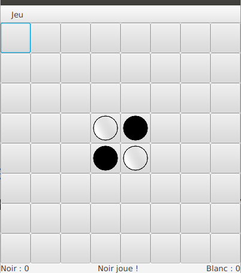

#  Introduction aux IHM en Java 

### IUT d’Aix-Marseille – Département Informatique Aix-en-Provence

* **Cours:** [M2105](http://cache.media.enseignementsup-recherche.gouv.fr/file/25/09/7/PPN_INFORMATIQUE_256097.pdf)
* **Responsable intérimaire:** [Cyril Pain-Barre](mailto:cyril.pain-barre@univ-amu.fr)
* **Responsable habituel:** [Sébastien NEDJAR](mailto:sebastien.nedjar@univ-amu.fr)
* **Enseignants actuels:** [Sophie Nabitz](mailto:sophie.nabitz@univ-avignon.fr), [Cyril Pain-Barre](mailto:cyril.pain-barre@univ-amu.fr)
* **Besoin d'aide ?**
    * La page [Piazza de ce cours](https://piazza.com/univ-amu.fr/spring2017/m2105/home).
    * Consulter et/ou créér des [issues](https://github.com/IUTInfoAix-M2105/tp1/issues).
    * [Email](mailto:sebastien.nedjar@univ-amu.fr) pour une question d'ordre privée, ou pour convenir d'un rendez-vous physique.

## TP 4 : FXML [](https://travis-ci.com/IUTInfoAix-M2105/tp4)

JavaFX 11 regroupe un ensemble d'API permettant le développement rapide d'applications 
graphiques modernes (aussi bien que des jeux 3D !). La [documentation](https://openjfx.io/javadoc/11/) de JavaFX 11 se trouve à part de celle de 
[Java 11](https://docs.oracle.com/en/java/javase/11/docs/api/index.html) (qui inclut celle de ses prédécesseurs AWT et Swing).

Ce TP continue l'exploration des mécanismes clefs de JavaFX 8.0 comme le FXML.

#### Création de votre fork du TP

La première chose que vous allez faire est de créer un fork d'un dépôt. Pour ce faire, rendez-vous sur le lien suivant : 

[https://classroom.github.com/a/eQPtcoro](https://classroom.github.com/a/eQPtcoro) 

Comme pour le TP1, GitHub va vous créer un dépôt contenant un fork du dépôt 'IUTInfoAix-m2105/tp4' et s'appellant 'IUTInfoAix-m2105/tp4-votreUsername'. 
Vous apparaîtrez automatiquement comme contributeur de ce projet pour y pousser votre travail.

Une fois votre fork créé, il vous suffit de l'importer dans IntelliJ.

### Exercice 1 : Création de l'IHM d'une application en FXML

Avec JavaFX, les interfaces peuvent être créées de deux manières :

  * Procédurale : en écrivant du code Java qui fait appel aux API de la plateforme et qui utilise les composants/conteneurs à
disposition (classes et interfaces)

  * Déclarative : en décrivant l'interface dans un fichier au format FXML qui sera ensuite chargé dynamiquement dans l'application

Au centre de l'approche déclarative, se trouvent les fichiers FXML. Un fichier FXML est un fichier au format XML dont la syntaxe est conçue pour décrire l'interface (la vue) avec ses composants, ses
conteneurs, sa disposition, …

  * Le fichier FXML décrit le "quoi" mais pas le "comment"

A l'exécution, le fichier FXML sera chargé par l'application (classe `FXMLLoader`) et un objet Java sera créé (généralement la racine est un conteneur) avec les éléments que le fichier décrit (les composants, conteneurs, graphiques, …).
Il est possible de créer les fichiers FXML avec un éditeur de texte mais, plus généralement, on utilise un outil graphique (*SceneBuilder*)
qui permet de concevoir l'interface de manière conviviale et de générer automatiquement le fichier FXML correspondant.


Les objets créés par le chargement de fichiers FXML peuvent être assignés à la racine d'un graphe de scène ou représenter un des nœuds dans un graphe de scène créé de manière procédurale.
Une fois chargés, les nœuds issus de fichiers FXML sont totalement équivalents à ceux créés de manière procédurale. Les mêmes
opérations et manipulations peuvent leur être appliquées.

Même si certaines possibilités existent (en lien notamment avec du code JavaScript) on conseille généralement d'utiliser 
les fichiers FXML exclusivement pour décrire les interfaces, et d'effectuer tous les traitements (activité des contrôleurs) dans le code Java.


Lors du chargement du fichier FXML, son contenu est interprété et des objets Java correspondants sont créés.

Par exemple, l'élément :

```xml
<BorderPane prefHeight="80.0" prefWidth="250.0" ...>
```
sera interprété comme :

```java
BorderPane rootPane = new BorderPane();
rootPane.setPrefHeight(80.0);
rootPane.setPrefWidth(250.0);
```

Quand un attribut commence par le nom d'une classe suivi d'un point et d'un identificateur, par exemple :

```xml
<TextField GridPane.columnIndex="3" . . . >
```

l'attribut sera interprété comme une invocation de méthode statique :

```java
TextField tfd = new TextField();
GridPane.setColumnIndex(tfd, 3);
```

Pour les propriétés qui ne peuvent pas facilement être représentées par une chaîne de caractères, un élément est 
imbriqué (plutôt que de déclarer des attributs).

Par exemple, si l'on considère l'élément :
```xml
<Label id="title" fx:id="title" text="Titre" textFill="#0022cc"
BorderPane.alignment="CENTER">
<font>
<Font name="SansSerif Bold" size="20.0" />
</font>
</Label>
```
On constate que la propriété `Font` est codée comme un élément imbriqué dans l'élément Label. Pour les propriétés de type liste (par exemple `children`), les éléments de la liste sont simplement imbriqués et 
répétés dans l'élément représentant la liste (par exemple, les composants enfants seront listés entre les balises `<children>` et `</children>`).


Le lien entre les composants décrits dans le fichier FXML et le programme est établi par les attributs `fx:id` :
```xml
<Label id="title" fx:id="title" text="Titre" textFill="#0022cc" ...>
```

L'attribut `fx:id` fonctionne en lien avec l'annotation `@FXML` que l'on peut utiliser dans les contrôleurs, et qui 
va indiquer au système que le composant avec le nom `fx:id` pourra être injecté dans l'objet correspondant de la 
classe contrôleur.

```java
public class SayHelloController {
   @FXML
   private Button btnHello;
   @FXML // fx:id="title"
   private Label title; // Object injected by FXMLLoader
```


La classe qui joue le rôle de contrôleur pour une interface déclarée en FXML doit être annoncée dans l'élément racine, 
en utilisant l'attribut `fx:controller` :
```xml
<BorderPane prefHeight="80.0" prefWidth="250.0"
style="-fx-background-color: #FFFCAA;"
xmlns=http://javafx.com/javafx/8
xmlns:fx=http://javafx.com/fxml/1
fx:controller="SayHelloController">
...
```

Pour les composants actifs déclarés dans une interface en FXML, on peut indiquer la méthode du contrôleur qui doit être invoquée en
utilisant l'attribut `fx:onEvent="#methodName"` :

```xml
<Button fx:id="btnHello" onAction="#handleButtonAction" 
      text="Say Hello" BorderPane.alignment="CENTER" />
```

Dans la classe contrôleur, ces méthodes devront (comme les composants associés) être annotées avec `@FXML`.

```java
@FXML
private void handleButtonAction(ActionEvent event) {
   title.setText("Hello !");
   title.setTextFill(Color.FUCHSIA);
}
```

Dans les classes qui agissent comme "contrôleurs", on peut définir une méthode `initialize()` (qui doit être annotée 
avec `@FXML`) pour effectuer certaines initialisations.

- Cette méthode est automatiquement invoquée après le chargement du fichier FXML.

- Elle peut être utile pour initialiser certains composants, en faisant par exemple appel au modèle.

```java
@FXML
private void initialize() {
   cbbCountry.getItems().addAll("Allemagne", "Angleterre", "Belgique",
         "Espagne", "France", "Italie",
         "Pays-Bas", "Portugal", "Suisse");
   lstProducts.getItems().addAll(model.getProducts());
. . .
}
```

Il est possible d'accéder au contrôleur associé au fichier FXML en créant un chargeur (loader) pour ce fichier (plutôt que d'utiliser la
méthode statique `FXMLLoader.load()`). Cela peut être utile pour avoir accès au contrôleur, par exemple pour
lui communiquer la référence du modèle de l'application 
   ```java
   public void start(Stage primaryStage) throws Exception {
         //--- Chargement du fichier FXML et recherche du contrôleur associé
         FXMLLoader loader = new FXMLLoader(getClass().getResource("SayHello.fxml"));
         BorderPane root = loader.load();
         SayHelloController ctrl = loader.getController();
         ctrl.setModel(model);
         Scene scene = new Scene(root);
   ```
#### Travail à réaliser
- Aller dans le paquetage `exercice1` et ouvrir les trois fichiers qui s'y trouvent.

- Lancer la classe `CounterMain` pour observer et comprendre le fonctionnement du chargement d'une IHM décrite en FXML.

- Remplacer le binding du texte du label fait en FXML (`text="${controller.counter}"`) par un binding programmatique.

- Rajouter un second bouton pour décrémenter la valeur de la propriété `counter`.

- En cliquant dans l'onglet *Scene Builder* en bas de l'éditeur FXML, personnalisez l'affichage de votre fenêtre en 
changeant la couleur de fond et la taille de la police des différents boutons.

### Exercice 2 : Création d'un composant personnalisé en FXML
Dans cet exercice, nous allons voir comment créer des composants personnalisés avec du FXML. La création de nouveau 
composant peut être nécessaire pour modulariser une IHM. En plus de mieux découper le code en ensembles cohérents et 
maîtrisables, chaque composant pourra être ainsi réutilisé par la suite dans un autre contexte. 

Le composant que nous allons créer sera un classique écran de login. La principale différence entre un composant 
personnalisé et une IHM quelconque en FXML se situe au niveau de nœud principal. Le parent utilisera un nœud 
`<fx:root>` dans ce nœud, il devra indiquer le type de cette racine et ne surtout pas préciser le controleur.

Dans le code du composant, notre composant devra étendre le type indiqué dans le nœud `<fx:root>`. Le chargement du 
FXML interviendra directement dans le constructeur par défaut. Il faudra préciser à ce moment là que l'objet courant 
sera à la fois la racine (`setRoot()`) et le contrôleur (`setController()`) de la vue FXML.

Les propriétés exposées par le composant devront posséder des accesseurs publiques.

#### Travail à réaliser
- Aller dans le paquetage `exercice2` et ouvrir les trois fichiers qui s'y trouvent.

- Lancer la classe `LoginMain` pour observer et comprendre le fonctionnement du chargement d'une IHM décrite en FXML.

- Ajouter la feuille de style `Login.css` (disponible comme ressource) pour personnaliser l'affichage de votre composant. Ne pas utiliser **Scene Builder** pour cela.

### Exercice 3 : Reversi

L'objet de cet exercice est l'écriture en Java de l'IHM d'une version simplifiée du jeu Othello. C' est un jeu de société 
combinatoire abstrait, qui oppose deux joueurs. 

Il se joue sur un tablier unicolore de 64 cases (8x8) appelé *othellier*. Les colonnes sont numérotées de gauche à droite 
par les lettres **a** à **h** ; les lignes sont numérotées de haut en bas par les chiffres **1** à **8**.

Les joueurs disposent de 64 pions bicolores, noirs d'un côté et blancs de l'autre. En début de partie, quatre pions sont 
déjà placés au centre de l'othellier : deux noirs, en ``e4`` et ``d5``, et deux blancs, en ``d4`` et ``e5``.


[V]: src/main/resources/assets/vide.png
[B]: src/main/resources/assets/blanc.png
[N]: src/main/resources/assets/noir.png
[G]: src/main/resources/assets/noir_transparent.png
[H]: src/main/resources/assets/blanc_transparent.png

|     | a    | b    | c    | d    | e    | f    | g    | h    |
| --- | ---- | ---- | ---- | ---- | ---- | ---- | ---- | ---- |
|**1**|![][V]|![][V]|![][V]|![][V]|![][V]|![][V]|![][V]|![][V]|
|**2**|![][V]|![][V]|![][V]|![][V]|![][V]|![][V]|![][V]|![][V]|
|**3**|![][V]|![][V]|![][V]|![][V]|![][V]|![][V]|![][V]|![][V]|
|**4**|![][V]|![][V]|![][V]|![][B]|![][N]|![][V]|![][V]|![][V]|
|**5**|![][V]|![][V]|![][V]|![][N]|![][B]|![][V]|![][V]|![][V]|
|**6**|![][V]|![][V]|![][V]|![][V]|![][V]|![][V]|![][V]|![][V]|
|**7**|![][V]|![][V]|![][V]|![][V]|![][V]|![][V]|![][V]|![][V]|
|**8**|![][V]|![][V]|![][V]|![][V]|![][V]|![][V]|![][V]|![][V]|


Chaque joueur, noir et blanc, pose l'un après l'autre un pion de sa couleur sur l'othellier selon les règles définies 
ci-après. Le jeu s'arrête quand les deux joueurs ne peuvent plus poser de pion. On compte alors le nombre de pions. 
Le joueur ayant le plus grand nombre de pions de sa couleur sur l'othellier a gagné.


#### Règles du jeu

Noir commence toujours la partie. Puis les joueurs jouent à tour de rôle, chacun étant tenu de *capturer* des pions 
adverses lors de son mouvement. Si un joueur ne peut pas *capturer* de pions adverses, il est forcé de passer son tour. 
Si aucun des deux joueurs ne peut jouer, ou si l'othellier ne comporte plus de case vide, la partie est terminée. 
Le gagnant en fin de partie est celui qui possède le plus de pions sur l'othellier.

La capture de pions survient lorsqu'un joueur place un de ses pions à l'extrémité d'un alignement de pions adverses 
contigus et dont l'autre extrémité est déjà occupée par un de ses propres pions. Les alignements considérés peuvent 
être une colonne, une ligne, ou une diagonale. Si le pion nouvellement placé vient fermer plusieurs alignements, il 
capture tous les pions adverses des lignes ainsi fermées. La capture se traduit par le retournement des pions capturés. 
Ces retournements n'entraînent pas d'effet de capture en cascade : seul le pion nouvellement posé est pris en compte.

Par exemple, la figure ci-dessus montre la position de départ. La première figure ci-dessous, montre les 4 cases où Noir 
peut jouer, grâce à la capture d'un pion Blanc.


|     | a    | b    | c    | d    | e    | f    | g    | h    |
| --- | ---- | ---- | ---- | ---- | ---- | ---- | ---- | ---- |
|**1**|![][V]|![][V]|![][V]|![][V]|![][V]|![][V]|![][V]|![][V]|
|**2**|![][V]|![][V]|![][V]|![][V]|![][V]|![][V]|![][V]|![][V]|
|**3**|![][V]|![][V]|![][V]|![][G]|![][V]|![][V]|![][V]|![][V]|
|**4**|![][V]|![][V]|![][G]|![][B]|![][N]|![][V]|![][V]|![][V]|
|**5**|![][V]|![][V]|![][V]|![][N]|![][B]|![][G]|![][V]|![][V]|
|**6**|![][V]|![][V]|![][V]|![][V]|![][G]|![][V]|![][V]|![][V]|
|**7**|![][V]|![][V]|![][V]|![][V]|![][V]|![][V]|![][V]|![][V]|
|**8**|![][V]|![][V]|![][V]|![][V]|![][V]|![][V]|![][V]|![][V]|

Enfin, la figure suivante montre la position résultante si Noir joue en d3. Le pion Blanc d4 a été capturé (retourné), 
devenant ainsi un pion Noir.


|     | a    | b    | c    | d    | e    | f    | g    | h    |
| --- | ---- | ---- | ---- | ---- | ---- | ---- | ---- | ---- |
|**1**|![][V]|![][V]|![][V]|![][V]|![][V]|![][V]|![][V]|![][V]|
|**2**|![][V]|![][V]|![][V]|![][V]|![][V]|![][V]|![][V]|![][V]|
|**3**|![][V]|![][V]|![][V]|![][N]|![][V]|![][V]|![][V]|![][V]|
|**4**|![][V]|![][V]|![][V]|![][N]|![][N]|![][V]|![][V]|![][V]|
|**5**|![][V]|![][V]|![][V]|![][N]|![][B]|![][V]|![][V]|![][V]|
|**6**|![][V]|![][V]|![][V]|![][V]|![][V]|![][V]|![][V]|![][V]|
|**7**|![][V]|![][V]|![][V]|![][V]|![][V]|![][V]|![][V]|![][V]|
|**8**|![][V]|![][V]|![][V]|![][V]|![][V]|![][V]|![][V]|![][V]|


#### Travail à réaliser
Votre travail dans la suite de ce sujet sera d'écrire pas à pas plusieurs classes importantes :

- Un objet `OthelloMain` est une fenêtre de jeu avec laquelle les joueurs interagiront pour faire une partie à tour de rôle.

- Un objet `Othellier` représente le plateau de jeu composé des 64 cases.

- Un objet `Case` représente une case de l'othellier.

- Un objet `Joueur` permet de conserver les informations associées à chaque joueur.

- Un objet `StatusBar` permet d'afficher les scores et l'état de la partie.


Il y aura aussi plusieurs classes de moindre importance qui serviront d'outils pour les classes principales.

Le résultat attendu devra ressembler à la fenêtre suivante :




#### Etape 1 : Implémentation de la classe `Joueur`
La classe `Joueur` permet de conserver les informations sur les deux joueurs d'une partie d'Othello. 
Cette classe a la responsabilité principale de gérer le score des joueurs.

1. Écrire la classe `Joueur` ayant pour commencer, deux données membres privées. La première appelée `score` sera une propriété de 
  type `IntegerProperty`. La seconde `image` de type `Image` permettra de conserver l'image affichée dans les cases de l'othellier.

2. Écrire le constructeur `Joueur(String fileName)` qui crée l'`Image` à partir du nom de fichier passé en paramètre
   et initialise le score à 0.
   
3. Écrire les accesseurs `public int getScore()`, `public IntegerProperty scoreProperty()` et `public Image getImage()`
qui retournent la valeur des données membres correspondantes.

4. Écrire les accesseurs `public void incrementerScore()`, `public void decrementerScore()` et 
`private void setScore(int score)` qui permettent de modifier le score d'un joueur.

5. Les joueurs étant connus à l'avance (`BLANC` et `NOIR`), leur création peut être faite de manière statique. 
Pour éviter d'avoir à complexifier notre code avec des valeurs nulles, un joueur virtuel (`PERSONNE`) sera ajouté. 
Écrire la déclaration statiques des 3 Joueurs (`BLANC`, `NOIR`, `PERSONNE`) qui devront utiliser les images appelées 
"blanc.png", "noir.png" et "vide.png" situé dans les ressources.

6. Écrire la méthode `public Joueur suivant()` qui retourne le joueur `BLANC` si le joueur est `NOIR` et `NOIR` si le 
joueur est `BLANC`. L'appel de cette méthode sur tout autre joueur retourne `PERSONNE`. 

7. Écrire la méthode `public static void initialiserScores()` qui initialise à 0 les scores des joueurs `BLANC` et `NOIR`.

#### Etape 2 : Implémentation de la classe `Case`
Pour réaliser le plateau de jeu, il nous faut des boutons qui se souviennent de leur position dans l'othellier. 
Au moment de leur construction, de tels boutons reçoivent les valeurs des indices ligne et colonne 
qui définissent leur placement dans la matrice. Ils les mémoriseront dans des variables d’instance privées. En 
plus de ces coordonnées, il faut connaître le joueur qui possède la case pour y dessiner l'image de son jeton.

Écrire la classe publique `Case` qui représente les boutons de notre tableau de jeu. Cette classe aura les 
caractéristiques suivantes :

- Elle étend la classe `Button`.

- Elle contient deux données membres privée de type `int` nommées `ligne` et `colonne` pour mémoriser les coordonnées. 

- Elle contient aussi une donnée membre privée de type `Joueur` appelée `possesseur`.

- Elle a un unique constructeur qui prend deux arguments (ligne, colonne) et les mémorise dans les variables d’instance 
correspondantes. Par défaut, une case n'appartient à PERSONNE. On propose un côté de 50 par case. Attention, les images fournies à attacher à la case pour y dessiner le jeton ne sont pas de la même taille.

- Elle possède trois getters :  `public Joueur getPossesseur()`, `public int getLigne()` et  `public int getColonne()`.

- Elle possède un setter `public void setPossesseur(Joueur possesseur)`, qui modifie la donnée membre correspondante et 
modifie l'image du bouton en utilisant la méthode `setImage(Image image)` sur la donnée membre `imageView`.

#### Etape 3 : Implémentation de la classe `StatusBar`
La classe `StatusBar` est un composant graphique permettant d'afficher l'état de la partie en cours. L'affichage est 
constitué de trois zones. Celle de gauche, affiche le score du joueur noir, celle de droite celle du joueur blanc et la 
partie centrale un message qui indique le joueur courant.

Nous allons écrire un composant spécialisé pour cette classe. Comme dans l'exercice 2, nous utiliserons FXML pour 
concevoir ce composant. 

Écrire le fichier FXML `StatusBarView.fxml` qui sera composé d'une racine de type `BorderPane`. Dans la zone gauche,
placer un `Label` ayant pour `fx:id` la valeur `messageScoreNoir`. De même, au centre le panel devra avoir pour 
`fx:id` la valeur `messageTourDeJeu` et à droite `messageScoreBlanc`.

Ouvrir maintenant la classe `StatusBar` qui représentera le composant de la barre d'état de notre jeu. Cette classe aura les 
caractéristiques suivantes :

- Elle contient trois données membres du type `Label` qui seront à mettre en correspondance avec le fichier FXML.

- Elle possédera une propriété de type `ObjectProperty<Joueur>` nommée `joueurCourant` qui mémorisera le joueur qui doit 
placer un pion.

- Elle possédera les accesseurs pour récupérer cette propriété.

- La méthode `createBinding()` créera les bindings entre les labels droite et gauche et les scores des joueurs correspondants.
 Le label central se liera à la propriété `joueurCourant` pour construire son texte.
 
- Le constructeur de la classe, devra charger comme il se doit le fichier FXML. Vous pouvez vous inspirer du code donné 
à l'exercice 2.
 
#### Etape 4 : Implémentation de la classe `Othellier`
Cette classe est celle qui permet d'implémenter toute la logique du jeu. 

1. Écrire la classe `Othellier` qui dérive de `GridPane`. Cette classe aura les données membres privées suivantes : 
     - `taille` de type `int` qui mémorise la taille du plateau de jeu.
     - `cases` est une matrice de `taille x taille` `Case` qui représente le plateau de jeu.
     - `joueurCourant` de type `ObjectProperty<Joueur>` qui mémorise le joueur dont c'est le tour.
     
2. Écrire la méthode `private void vider()` qui parcourt toutes les cases une par une et les affecte à `PERSONNE`.

3. Écrire la méthode `private void positionnerPionsDebutPartie()` qui place dans les cases adéquates les deux 
pions `BLANC` et les deux pions `NOIR` du début de partie. Il faudra veiller à incrémenter les scores de chacun des joueurs.

4. Écrire la méthode `public void nouvellePartie()` qui initialise le joueur courant, les scores, vide l'othellier et positionne les pions en début de partie.

5. Écrire le constructeur public de la classe `Othellier` qui prendra en paramètre la taille de la matrice de jeu. 
Ce constructeur devra :
    - mémoriser le paramètre taille dans la donnée membre correspondante.
    
    - créer la matrice `cases` avec `taille` lignes et `taille` colonnes.
     
    - créer toutes les cases de la matrice et les ajouter à l'othellier à l'aide de `remplirOthelier()`.
    
    - appeler `adapterLesLignesEtColonnes()` afin de fixer des contraintes sur la grille.
    
    - vider l'othellier.
    
    - positionner les pions dans leur configuration initiale.
    
6. Supposons que l'on dispose d'une méthode `private List<Case> casesCapturables(Case caseSelectionnee)` qui permet de 
connaître la liste des cases capturables si le `joueurCourant` dépose un jeton sur la case `caseSelectionnee`. Écrire la 
méthode `boolean estPositionJouable(Case caseSelectionnee)` qui permet de savoir si le `joueurCourant` a le droit de déposer 
un jeton sur la case `caseSelectionnee`. Une position est jouable si la case est vide et si l'on capture au moins un pion 
adverse.

7. Écrire la méthode `private List<Case> casesJouables()` qui retourne la liste de toutes les cases jouables par 
le `joueurCourant`. Pour ce faire, vous pouvez parcourir toutes les cases vides (celles qui n'appartiennent à `PERSONNE`) 
et les ajouter au résultat si elles sont jouables.

8. Écrire la méthode `public boolean peutJouer()` qui retourne `true` s'il existe une position où le `joueurCourant` 
peut poser son pion.

9. Écrire la méthode `private void tourSuivant()` qui affecte à `joueurCourant` le prochain joueur qui doit jouer. 
Si aucun des deux joueurs ne peut jouer, la partie est terminée et la donnée membre `joueurCourant` est positionnée 
à `PERSONNE`.

10. Écrire la méthode `private void capturer(Case caseCapturee)` qui capture la case `caseCapturee` et retourne 
toute les cases capturables à partir de cette case. Cette méthode s'occupe aussi d'incrémenter et de décrémenter 
le score de chaque joueur pour maintenir le score à jour.

11. On s’intéresse maintenant à ce qui doit se passer lorsqu’un joueur appuie sur un bouton. Pour cela, avec une expression lambda, vous allez écrire une classe implémentant l’interface `EventHandler<ActionEvent>`. On conservera une seule instance utilisée comme auditeur de tous les « événements action » produits par les boutons du jeu dans la donnée membre `caseListener`.

Écrivez une classe `AuditeurCase`, interne à la classe `Othellier`, implémentant l’interface `EventHandler<ActionEvent>`. 

Cette classe se réduit à la méthode imposée `public void handle(ActionEvent evt)`, qui doit effectuer les tâches suivantes :
    
   - identifier le bouton ayant produit l’événement (pensez à la méthode `getSource()` du paramètre `evt`).
    
   - vérifier que la position choisie est jouable.
    
   - capturer toutes les cases capturables.
    
   - choisir le prochain joueur qui doit jouer.
    
On notera qu'une unique instance de cette classe doit être ajoutée comme auditeur de toutes les cases.

12. Écrire la méthode `public ObjectProperty<Joueur> joueurCourantProperty()` qui retourne la propriété correspondante.

13. Écrire la méthode `private boolean estIndicesValides()` qui utilise `estIndiceValide()` et retourne vrai si la cellule correspondant à la ligne et colonne donnés en paramètre a un indice valide.

14. La méthode `private List<Case> casesCapturables(Case caseSelectionnee)` qui retourne la liste des cases 
capturables si le `joueurCourant` dépose un jeton sur la case `caseSelectionnee` vous est donnée. Cette méthode vérifie dans toute les directions quel est l'ensemble des cases capturables. Elle utilise la méthode `estIndicesValides()` précédente.

#### Étape 5 : Implémentation de la classe `OthelloController`
La classe `OthelloController` et le fichier FXML `OthelloView` représentent le contenu de la fenêtre principale du Jeu. 
En plus d'un othellier situé au centre, cette scène contient une barre de menu et une barre de statut en bas. La barre 
de menu contient un menu "Action" constitué d'une entrée "Nouvelle Partie" et d'une entrée "Quitter".

1. Écrire la déclaration d’une classe `OthelloController`, réduite, pour commencer, à 
ses variables d’instance, toutes privées :

    - `statusBar` de type `StatusBar` est l'objet matérialisant la barre de statut

    - `othellier` de type `Othellier` est l'objet plateau de jeu

2. Écrire le ficher FXML décrivant la structure de l'IHM de notre jeu. La racine de la scène sera un objet du 
type `BorderPane` qui contiendra une `MenuBar`, un `Othelier` et une `StatusBar`. Rajouter les bonnes valeurs 
aux attributs `fx:id` pour que les données membres du contrôleur soient en correspondance avec les composants associés.


3. Écrire la méthode `public void initialize()` qui sera appelée par le `loader` lors du chargement du FXML. 
Cette méthode devra :

    - tout d'abord ajouter un écouteur sur la propriété `joueurCourant` de l'othelier pour vérifier si le `joueurCourant` 
    est positionné à `PERSONNE` pour ouvrir un dialogue annonçant la fin de partie avec la méthode `afficheDialogFinDePartie`.

    - lier le `joueurCourant` de la `statusBar` avec celui de l'othelier pour que la barre d'état adapte son contenu à 
    chaque étape du jeu.

4. Écrire la méthode `public void actionMenuJeuNouveau()` qui sera appelée par l'item de menu permettant de créer une 
nouvelle partie. Cette méthode devra prévenir l'utilisateur avec une fenêtre de confirmation pour lui demander s'il est 
certain de vouloir créer une nouvelle partie en arrêtant celle en cours. Pour cela, vous utiliserez la classe `Alert` 
avec un titre et un contenu adapté. Si l'utilisateur répond `OK`, une nouvelle partie est créée en appelant la méthode 
`nouvellePartie()` de l'othelier.

5. Écrire la méthode `public void actionMenuJeuQuitter()` qui sera appelée par l'item de menu permettant de quitter le jeu.
Cette méthode devra prévenir l'utilisateur avec une fenêtre de confirmation. Pour cela, vous utiliserez la classe `Alert` 
avec un titre et un contenu adapté. Si l'utilisateur répond `OK`, le programme se termine proprement en appelant la 
méthode `Platform.exit();`.

6. Écrire la méthode `setStageAndSetupListeners(Stage stage)` qui rajoutera un écouteur d'événement à la fermeture de la 
fenêtre principale (voir `setOnCloseRequest()`). Cet écouteur se comportera comme l'action Quitter du menu. Si 
l'utilisateur ne valide pas, l'événement sera consommé (`event.consume()`) pour empêcher la fermeture de la fenêtre.


7. Écrire la méthode `afficheDialogFinDePartie()` qui affiche une fenêtre d'information qui indiquera le vainqueur de 
la partie courante. Pour cela, vous utiliserez la classe `Alert` avec un titre et un contenu adapté. Le dialogue sera 
affiché et attendra que l'utilisateur le ferme.

#### Étape 6 : Implémentation de la classe `OthelloMain`
La classe `OthelloMain` est le programme principal de notre application. C'est elle qui a la responsabilité de 
charger la vue principale et de l'ajouter à la scène.

1. Écrivez une méthode `main` aussi réduite que possible pour lancer l’exécution de tout cela.


2. Écrire la méthode `public void start(Stage primaryStage)`. Elle devra :
    - Modifier le titre de la fenêtre en "Othello".

    - Créer un objet `loader` du type `FXMLLoader` et charger le `BorderPane` principal à partir du fichier `OthelloView.fxml`.
    
    - Récupérer le contrôleur du type `OthelloController` avec la méthode `getController()` du `loader`.
    
    - Appeler la méthode `setStageAndSetupListeners()` de la classe `OthelloController` qui rajoutera l'écouteur d'événement de fermeture de la fenêtre principale.

    - Ajouter le `BorderPane` comme racine du graphe de scène.

    - Rendre visible le stage.


